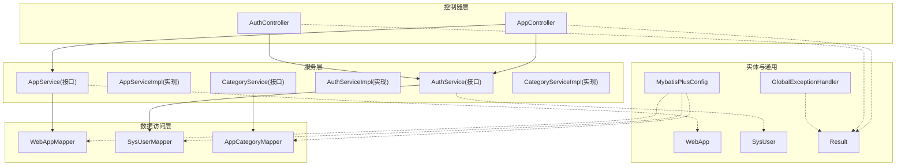
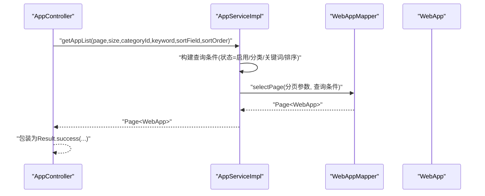
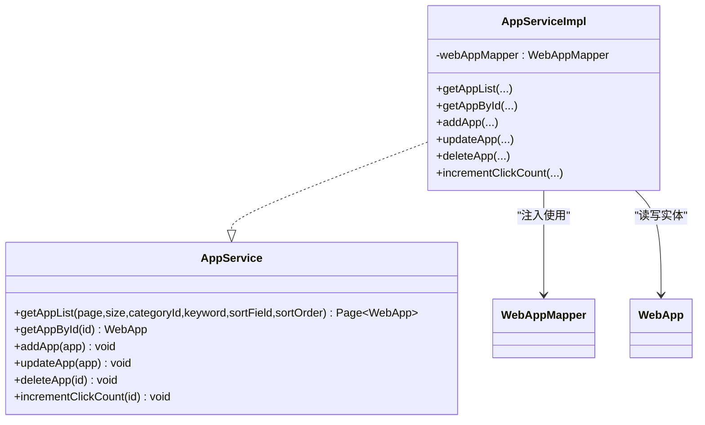
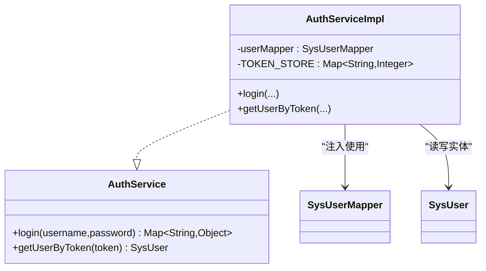
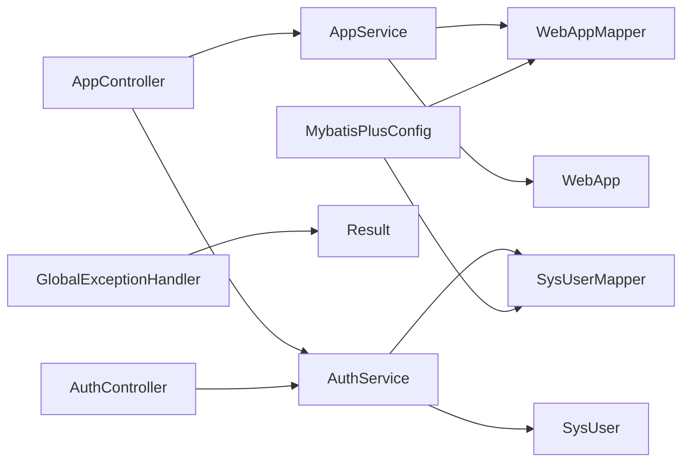
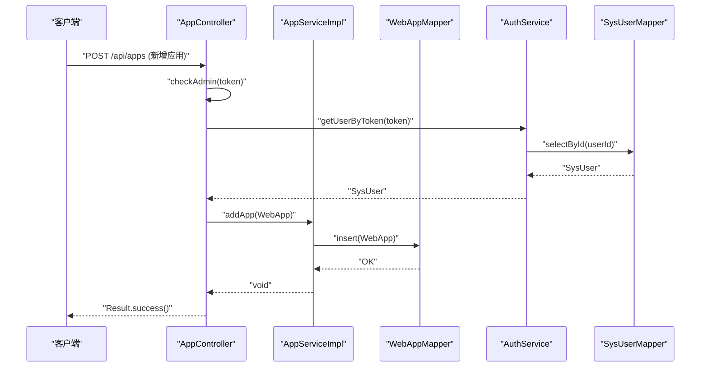
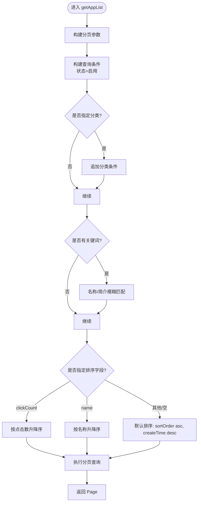

# Service层设计

<cite>
**本文引用的文件**   
- [AppService.java](file://backend/src/main/java/com/xx/platform/service/AppService.java)
- [AuthService.java](file://backend/src/main/java/com/xx/platform/service/AuthService.java)
- [CategoryService.java](file://backend/src/main/java/com/xx/platform/service/CategoryService.java)
- [AppServiceImpl.java](file://backend/src/main/java/com/xx/platform/service/impl/AppServiceImpl.java)
- [AuthServiceImpl.java](file://backend/src/main/java/com/xx/platform/service/impl/AuthServiceImpl.java)
- [CategoryServiceImpl.java](file://backend/src/main/java/com/xx/platform/service/impl/CategoryServiceImpl.java)
- [WebAppMapper.java](file://backend/src/main/java/com/xx/platform/mapper/WebAppMapper.java)
- [SysUserMapper.java](file://backend/src/main/java/com/xx/platform/mapper/SysUserMapper.java)
- [AppCategoryMapper.java](file://backend/src/main/java/com/xx/platform/mapper/AppCategoryMapper.java)
- [WebApp.java](file://backend/src/main/java/com/xx/platform/entity/WebApp.java)
- [SysUser.java](file://backend/src/main/java/com/xx/platform/entity/SysUser.java)
- [AppController.java](file://backend/src/main/java/com/xx/platform/controller/AppController.java)
- [AuthController.java](file://backend/src/main/java/com/xx/platform/controller/AuthController.java)
- [GlobalExceptionHandler.java](file://backend/src/main/java/com/xx/platform/common/GlobalExceptionHandler.java)
- [Result.java](file://backend/src/main/java/com/xx/platform/common/Result.java)
- [MybatisPlusConfig.java](file://backend/src/main/java/com/xx/platform/config/MybatisPlusConfig.java)
</cite>

## 目录
1. [引言](#引言)
2. [项目结构](#项目结构)
3. [核心组件](#核心组件)
4. [架构总览](#架构总览)
5. [详细组件分析](#详细组件分析)
6. [依赖关系分析](#依赖关系分析)
7. [性能与可扩展性](#性能与可扩展性)
8. [事务管理与配置](#事务管理与配置)
9. [异常处理与错误信息](#异常处理与错误信息)
10. [结论](#结论)
11. [附录：业务示例流程](#附录：业务示例流程)

## 引言
本设计文档聚焦于JZPlatform门户系统的Service层，阐述其作为业务逻辑核心的职责边界与设计模式。重点包括：
- 业务规则实现、数据验证、业务流程编排
- Service接口与实现类的分离设计
- AppService与AuthService的具体实现要点
- Service层如何协调多个Mapper完成复杂操作
- 业务异常与错误信息的统一处理
- 事务注解的使用场景与配置建议
- 以“应用管理”为例的完整业务流程说明

## 项目结构
后端采用分层架构：Controller负责HTTP请求接入与参数校验；Service封装业务逻辑并协调Mapper进行数据访问；Mapper基于MyBatis-Plus提供数据访问能力；Entity映射数据库表；Common提供统一响应与全局异常处理；Config提供框架级配置。

图表来源
- [AppController.java:1-111](file://backend/src/main/java/com/xx/platform/controller/AppController.java#L1-L111)
- [AuthController.java:1-68](file://backend/src/main/java/com/xx/platform/controller/AuthController.java#L1-L68)
- [AppService.java:1-47](file://backend/src/main/java/com/xx/platform/service/AppService.java#L1-L47)
- [AppServiceImpl.java:1-105](file://backend/src/main/java/com/xx/platform/service/impl/AppServiceImpl.java#L1-L105)
- [AuthService.java:1-27](file://backend/src/main/java/com/xx/platform/service/AuthService.java#L1-L27)
- [AuthServiceImpl.java:1-62](file://backend/src/main/java/com/xx/platform/service/impl/AuthServiceImpl.java#L1-L62)
- [CategoryService.java:1-32](file://backend/src/main/java/com/xx/platform/service/CategoryService.java#L1-L32)
- [CategoryServiceImpl.java:1-44](file://backend/src/main/java/com/xx/platform/service/impl/CategoryServiceImpl.java#L1-L44)
- [WebAppMapper.java](file://backend/src/main/java/com/xx/platform/mapper/WebAppMapper.java)
- [SysUserMapper.java](file://backend/src/main/java/com/xx/platform/mapper/SysUserMapper.java)
- [AppCategoryMapper.java](file://backend/src/main/java/com/xx/platform/mapper/AppCategoryMapper.java)
- [WebApp.java:1-54](file://backend/src/main/java/com/xx/platform/entity/WebApp.java#L1-L54)
- [SysUser.java:1-33](file://backend/src/main/java/com/xx/platform/entity/SysUser.java#L1-L33)
- [Result.java:1-53](file://backend/src/main/java/com/xx/platform/common/Result.java#L1-L53)
- [GlobalExceptionHandler.java:1-30](file://backend/src/main/java/com/xx/platform/common/GlobalExceptionHandler.java#L1-L30)
- [MybatisPlusConfig.java:1-27](file://backend/src/main/java/com/xx/platform/config/MybatisPlusConfig.java#L1-L27)

章节来源
- [AppController.java:1-111](file://backend/src/main/java/com/xx/platform/controller/AppController.java#L1-L111)
- [AuthController.java:1-68](file://backend/src/main/java/com/xx/platform/controller/AuthController.java#L1-L68)
- [MybatisPlusConfig.java:1-27](file://backend/src/main/java/com/xx/platform/config/MybatisPlusConfig.java#L1-L27)

## 核心组件
- AppService：定义应用CRUD、分页查询、点击计数等业务方法，面向Controller暴露稳定的业务契约。
- AuthService：定义登录认证与基于Token的用户信息查询，屏蔽认证细节（如Token存储策略）。
- CategoryService：定义分类的增删改查，支撑应用列表的分类筛选等上层需求。
- 对应实现类：在各自实现中组合Mapper完成数据访问，并在必要时注入业务规则与校验。

章节来源
- [AppService.java:1-47](file://backend/src/main/java/com/xx/platform/service/AppService.java#L1-L47)
- [AuthService.java:1-27](file://backend/src/main/java/com/xx/platform/service/AuthService.java#L1-L27)
- [CategoryService.java:1-32](file://backend/src/main/java/com/xx/platform/service/CategoryService.java#L1-L32)
- [AppServiceImpl.java:1-105](file://backend/src/main/java/com/xx/platform/service/impl/AppServiceImpl.java#L1-L105)
- [AuthServiceImpl.java:1-62](file://backend/src/main/java/com/xx/platform/service/impl/AuthServiceImpl.java#L1-L62)
- [CategoryServiceImpl.java:1-44](file://backend/src/main/java/com/xx/platform/service/impl/CategoryServiceImpl.java#L1-L44)

## 架构总览
Service层位于Controller与Mapper之间，承担以下职责：
- 接收来自Controller的请求参数，执行输入校验与业务规则判断
- 编排多个Mapper调用，组织跨实体的业务过程
- 封装领域模型到持久化模型的转换与默认值填充
- 抛出统一的业务异常，交由全局异常处理器转换为标准响应
- 为后续引入事务、缓存、审计等横切关注点预留扩展点

图表来源
- [AppController.java:31-40](file://backend/src/main/java/com/xx/platform/controller/AppController.java#L31-L40)
- [AppServiceImpl.java:23-62](file://backend/src/main/java/com/xx/platform/service/impl/AppServiceImpl.java#L23-L62)
- [WebAppMapper.java](file://backend/src/main/java/com/xx/platform/mapper/WebAppMapper.java)
- [WebApp.java:1-54](file://backend/src/main/java/com/xx/platform/entity/WebApp.java#L1-L54)

## 详细组件分析

### AppService与AppServiceImpl
- 职责边界
  - 对外暴露应用的分页查询、详情获取、新增、更新、删除、点击计数等方法
  - 内部负责查询条件组装、默认排序、状态过滤、时间戳与默认值填充
- 关键实现要点
  - 分页查询：通过LambdaQueryWrapper动态拼装条件，支持按分类、关键词模糊匹配、多字段排序
  - 详情获取：若不存在则抛出运行时异常，由全局异常处理器统一返回友好提示
  - 新增：设置初始点击次数、创建/更新时间、默认状态
  - 更新：仅更新传入字段，维护更新时间
  - 删除：直接按ID删除
  - 点击计数：先读取再自增后写回，保证可见性与一致性
- 复杂度与优化
  - 查询条件构造为O(1)分支判断，整体复杂度取决于数据库索引与排序字段
  - 点击计数存在读-改-写三步，可考虑使用原子SQL或乐观锁提升并发安全

图表来源
- [AppService.java:1-47](file://backend/src/main/java/com/xx/platform/service/AppService.java#L1-L47)
- [AppServiceImpl.java:1-105](file://backend/src/main/java/com/xx/platform/service/impl/AppServiceImpl.java#L1-L105)
- [WebAppMapper.java](file://backend/src/main/java/com/xx/platform/mapper/WebAppMapper.java)
- [WebApp.java:1-54](file://backend/src/main/java/com/xx/platform/entity/WebApp.java#L1-L54)

章节来源
- [AppService.java:1-47](file://backend/src/main/java/com/xx/platform/service/AppService.java#L1-L47)
- [AppServiceImpl.java:23-103](file://backend/src/main/java/com/xx/platform/service/impl/AppServiceImpl.java#L23-L103)
- [WebApp.java:1-54](file://backend/src/main/java/com/xx/platform/entity/WebApp.java#L1-L54)

### AuthService与AuthServiceImpl
- 职责边界
  - 登录：根据用户名密码查询用户，生成Token并建立Token到用户的映射
  - 鉴权：根据Token反查用户信息（不含敏感字段）
- 关键实现要点
  - 内存Token存储：使用ConcurrentHashMap保存Token->UserId映射，适合内部系统演示
  - 登录失败：抛出运行时异常，由全局异常处理器统一返回错误消息
  - Token查询：若Token无效返回null，上层Controller据此返回未登录/过期提示
- 扩展建议
  - 生产环境建议将Token存储迁移至Redis，增加过期时间与清理策略
  - 密码应加密存储与服务端校验，当前实现仅为演示

图表来源
- [AuthService.java:1-27](file://backend/src/main/java/com/xx/platform/service/AuthService.java#L1-L27)
- [AuthServiceImpl.java:1-62](file://backend/src/main/java/com/xx/platform/service/impl/AuthServiceImpl.java#L1-L62)
- [SysUserMapper.java](file://backend/src/main/java/com/xx/platform/mapper/SysUserMapper.java)
- [SysUser.java:1-33](file://backend/src/main/java/com/xx/platform/entity/SysUser.java#L1-L33)

章节来源
- [AuthService.java:1-27](file://backend/src/main/java/com/xx/platform/service/AuthService.java#L1-L27)
- [AuthServiceImpl.java:28-60](file://backend/src/main/java/com/xx/platform/service/impl/AuthServiceImpl.java#L28-L60)
- [SysUser.java:1-33](file://backend/src/main/java/com/xx/platform/entity/SysUser.java#L1-L33)

### CategoryService与CategoryServiceImpl
- 职责边界
  - 提供分类的增删改查，供应用管理等模块复用
- 关键实现要点
  - 查询所有分类并按排序序号升序排列
  - 新增时设置创建时间，更新/删除直接委托Mapper

章节来源
- [CategoryService.java:1-32](file://backend/src/main/java/com/xx/platform/service/CategoryService.java#L1-L32)
- [CategoryServiceImpl.java:22-42](file://backend/src/main/java/com/xx/platform/service/impl/CategoryServiceImpl.java#L22-L42)
- [AppCategoryMapper.java](file://backend/src/main/java/com/xx/platform/mapper/AppCategoryMapper.java)

## 依赖关系分析
- Controller依赖Service接口，避免耦合具体实现
- Service实现依赖对应的Mapper，遵循单一职责
- Entity用于承载数据，配合MyBatis-Plus注解完成ORM映射
- 全局异常处理器拦截运行时异常，统一返回Result格式
- MybatisPlusConfig注册分页插件，使分页查询生效

图表来源
- [AppController.java:1-111](file://backend/src/main/java/com/xx/platform/controller/AppController.java#L1-L111)
- [AuthController.java:1-68](file://backend/src/main/java/com/xx/platform/controller/AuthController.java#L1-L68)
- [AppService.java:1-47](file://backend/src/main/java/com/xx/platform/service/AppService.java#L1-L47)
- [AuthService.java:1-27](file://backend/src/main/java/com/xx/platform/service/AuthService.java#L1-L27)
- [WebAppMapper.java](file://backend/src/main/java/com/xx/platform/mapper/WebAppMapper.java)
- [SysUserMapper.java](file://backend/src/main/java/com/xx/platform/mapper/SysUserMapper.java)
- [WebApp.java:1-54](file://backend/src/main/java/com/xx/platform/entity/WebApp.java#L1-L54)
- [SysUser.java:1-33](file://backend/src/main/java/com/xx/platform/entity/SysUser.java#L1-L33)
- [GlobalExceptionHandler.java:1-30](file://backend/src/main/java/com/xx/platform/common/GlobalExceptionHandler.java#L1-L30)
- [Result.java:1-53](file://backend/src/main/java/com/xx/platform/common/Result.java#L1-L53)
- [MybatisPlusConfig.java:1-27](file://backend/src/main/java/com/xx/platform/config/MybatisPlusConfig.java#L1-L27)

章节来源
- [AppController.java:1-111](file://backend/src/main/java/com/xx/platform/controller/AppController.java#L1-L111)
- [AuthController.java:1-68](file://backend/src/main/java/com/xx/platform/controller/AuthController.java#L1-L68)
- [GlobalExceptionHandler.java:1-30](file://backend/src/main/java/com/xx/platform/common/GlobalExceptionHandler.java#L1-L30)
- [MybatisPlusConfig.java:1-27](file://backend/src/main/java/com/xx/platform/config/MybatisPlusConfig.java#L1-L27)

## 性能与可扩展性
- 查询性能
  - 建议在常用筛选字段（如status、categoryId、name、description）上建立合适索引
  - 对clickCount排序的场景，注意高并发下的热点行竞争
- 写入性能
  - 点击计数可采用原子更新（例如增量SQL）减少读放大
  - 批量操作建议使用批量插入/更新接口
- 可扩展性
  - 可在Service层引入缓存（如本地缓存或Redis）降低热点查询压力
  - 可通过AOP记录审计日志、埋点统计等横切关注点

[本节为通用指导，不直接分析具体文件]

## 事务管理与配置
- 现状
  - 当前Service实现未显式使用事务注解，单条CRUD操作具备原子性
  - 点击计数为读-改-写三步，存在并发竞态风险
- 建议
  - 对涉及多步写操作的接口（如新增应用同时写入关联数据）添加事务注解，确保一致性
  - 对热点计数器可使用数据库原子更新或分布式锁保障一致性
  - 若引入外部资源（如消息队列、第三方API），需考虑补偿与重试机制

[本节为通用指导，不直接分析具体文件]

## 异常处理与错误信息
- 统一响应
  - 所有成功响应通过Result.success封装，包含状态码、消息与数据
- 全局异常
  - GlobalExceptionHandler捕获RuntimeException与Exception，统一返回Result.error
  - 业务异常（如“应用不存在”、“用户名或密码错误”）在服务层抛出，便于集中处理
- 最佳实践
  - 服务层尽量抛出语义明确的业务异常，避免向客户端泄露堆栈信息
  - 对于参数校验失败，优先在Controller层快速失败并返回明确错误信息

章节来源
- [GlobalExceptionHandler.java:10-29](file://backend/src/main/java/com/xx/platform/common/GlobalExceptionHandler.java#L10-L29)
- [Result.java:23-51](file://backend/src/main/java/com/xx/platform/common/Result.java#L23-L51)
- [AppServiceImpl.java:64-71](file://backend/src/main/java/com/xx/platform/service/impl/AppServiceImpl.java#L64-L71)
- [AuthServiceImpl.java:28-51](file://backend/src/main/java/com/xx/platform/service/impl/AuthServiceImpl.java#L28-L51)

## 结论
Service层在本项目中承担了业务规则、流程编排与数据访问协调的核心职责。通过接口与实现的分离，提升了可测试性与可替换性；结合全局异常与统一响应，保证了对外交互的一致性与健壮性。后续可在事务管理、缓存、审计等方面进一步增强，以满足更高可用性与可观测性要求。

[本节为总结性内容，不直接分析具体文件]

## 附录：业务示例流程

### 应用管理完整业务流程（序列图）

图表来源
- [AppController.java:55-61](file://backend/src/main/java/com/xx/platform/controller/AppController.java#L55-L61)
- [AppController.java:98-109](file://backend/src/main/java/com/xx/platform/controller/AppController.java#L98-L109)
- [AppServiceImpl.java:73-82](file://backend/src/main/java/com/xx/platform/service/impl/AppServiceImpl.java#L73-L82)
- [AuthService.java:20-26](file://backend/src/main/java/com/xx/platform/service/AuthService.java#L20-L26)
- [AuthServiceImpl.java:53-60](file://backend/src/main/java/com/xx/platform/service/impl/AuthServiceImpl.java#L53-L60)
- [SysUserMapper.java](file://backend/src/main/java/com/xx/platform/mapper/SysUserMapper.java)
- [WebAppMapper.java](file://backend/src/main/java/com/xx/platform/mapper/WebAppMapper.java)

### 应用列表查询流程（流程图）

图表来源
- [AppServiceImpl.java:23-62](file://backend/src/main/java/com/xx/platform/service/impl/AppServiceImpl.java#L23-L62)
- [MybatisPlusConfig.java:19-25](file://backend/src/main/java/com/xx/platform/config/MybatisPlusConfig.java#L19-L25)