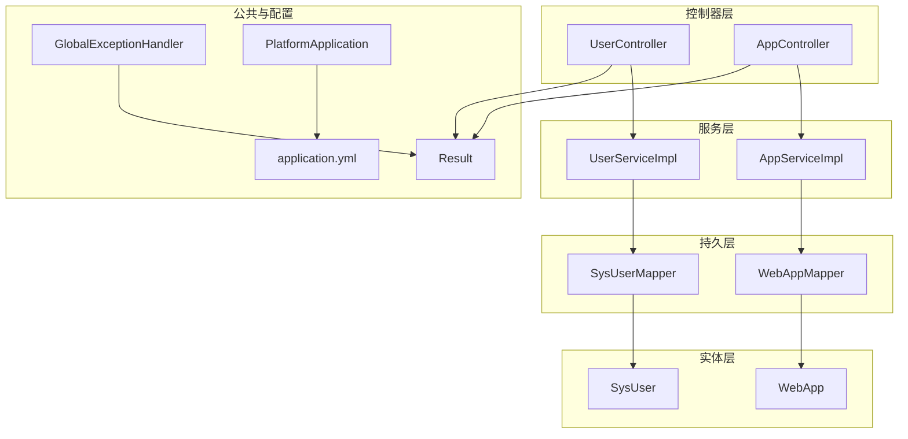
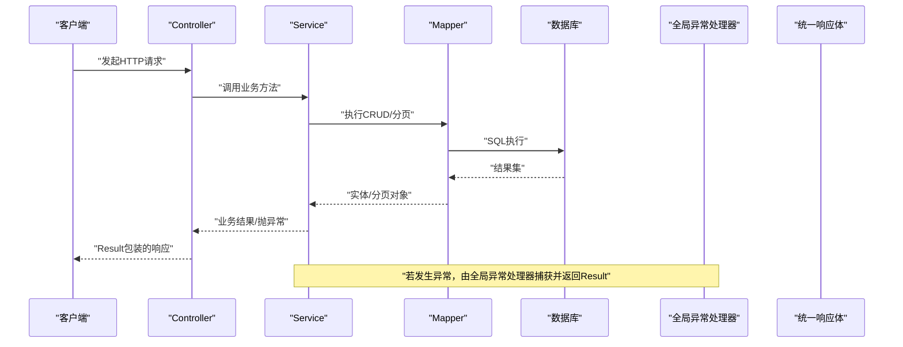
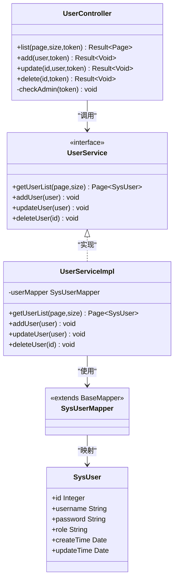
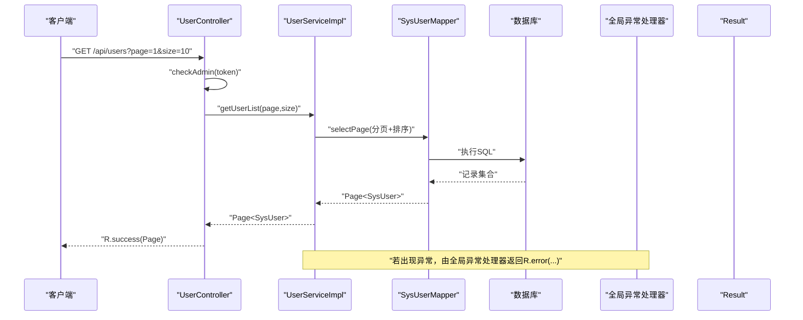
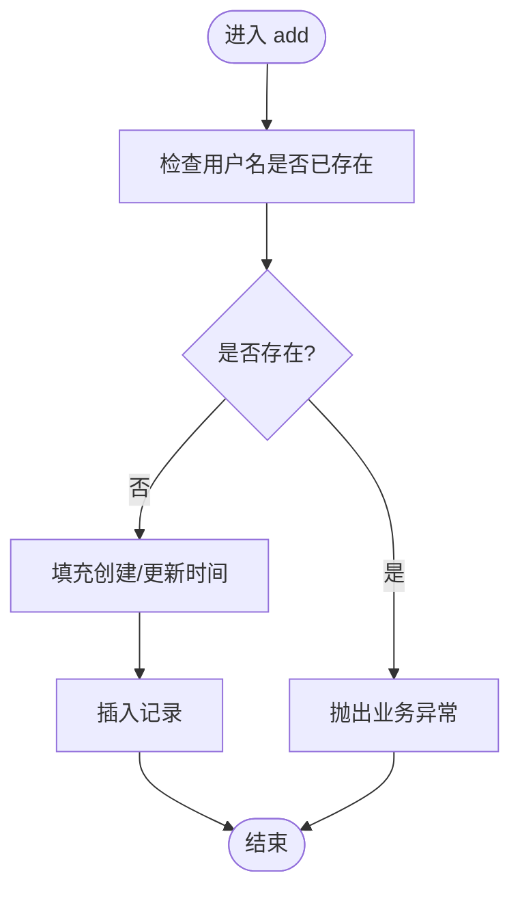
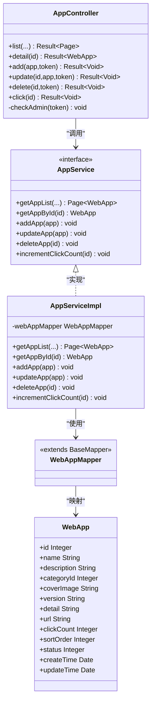
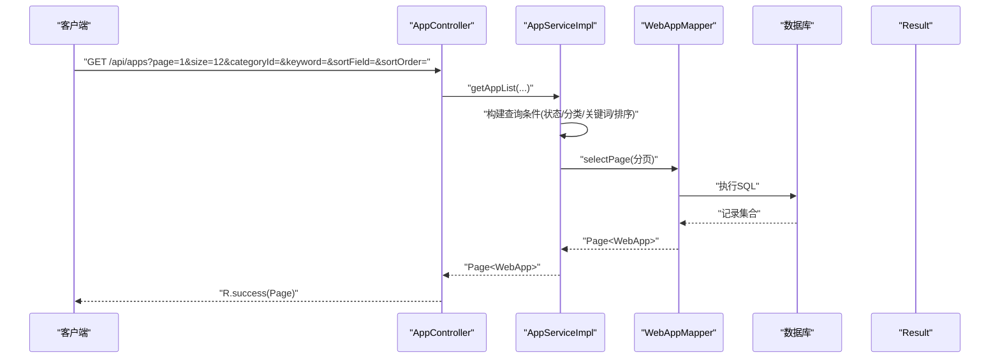
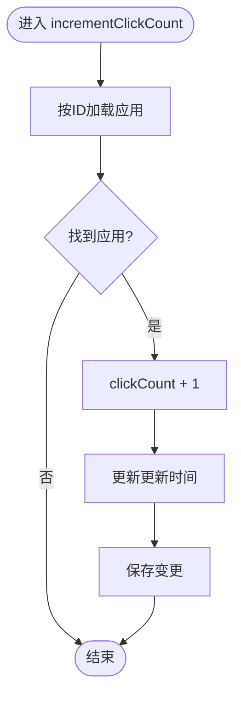
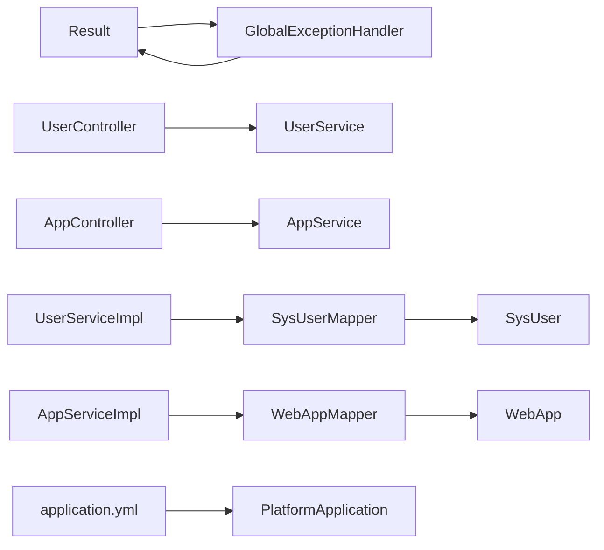

# 分层架构设计

<cite>
**本文引用的文件**   
- [PlatformApplication.java](file://backend/src/main/java/com/xx/platform/PlatformApplication.java)
- [application.yml](file://backend/src/main/resources/application.yml)
- [Result.java](file://backend/src/main/java/com/xx/platform/common/Result.java)
- [GlobalExceptionHandler.java](file://backend/src/main/java/com/xx/platform/common/GlobalExceptionHandler.java)
- [UserController.java](file://backend/src/main/java/com/xx/platform/controller/UserController.java)
- [UserService.java](file://backend/src/main/java/com/xx/platform/service/UserService.java)
- [UserServiceImpl.java](file://backend/src/main/java/com/xx/platform/service/impl/UserServiceImpl.java)
- [SysUserMapper.java](file://backend/src/main/java/com/xx/platform/mapper/SysUserMapper.java)
- [SysUser.java](file://backend/src/main/java/com/xx/platform/entity/SysUser.java)
- [AppController.java](file://backend/src/main/java/com/xx/platform/controller/AppController.java)
- [AppService.java](file://backend/src/main/java/com/xx/platform/service/AppService.java)
- [AppServiceImpl.java](file://backend/src/main/java/com/xx/platform/service/impl/AppServiceImpl.java)
- [WebAppMapper.java](file://backend/src/main/java/com/xx/platform/mapper/WebAppMapper.java)
- [WebApp.java](file://backend/src/main/java/com/xx/platform/entity/WebApp.java)
</cite>

## 目录
1. [简介](#简介)
2. [项目结构](#项目结构)
3. [核心组件](#核心组件)
4. [架构总览](#架构总览)
5. [详细组件分析](#详细组件分析)
6. [依赖关系分析](#依赖关系分析)
7. [性能考虑](#性能考虑)
8. [故障排查指南](#故障排查指南)
9. [结论](#结论)
10. [附录](#附录)

## 简介
本文件面向JZPlatform门户系统后端，系统化阐述基于Spring Boot的分层架构设计与实现。重点说明MVC模式中Controller、Service、Mapper、Entity各层的职责边界与交互方式，解释数据传递路径、异常处理机制与日志策略，并通过用户与应用两个典型业务域给出CRUD操作的端到端流程示例，帮助读者快速理解并扩展系统。

## 项目结构
后端采用典型的分层组织：
- Controller层：接收HTTP请求，参数校验与权限检查，调用Service，返回统一响应体。
- Service层：封装业务逻辑，协调多个Mapper完成事务性操作，抛出业务异常。
- Mapper层：基于MyBatis-Plus的DAO接口，提供基础CRUD与分页查询能力。
- Entity层：数据库表映射对象，承载字段与注解。
- 公共模块：统一响应体Result与全局异常处理器GlobalExceptionHandler。
- 配置与启动：应用入口PlatformApplication与配置文件application.yml（包含数据源、MyBatis-Plus、上传等）。

图表来源
- [UserController.java:1-88](file://backend/src/main/java/com/xx/platform/controller/UserController.java#L1-L88)
- [AppController.java:1-111](file://backend/src/main/java/com/xx/platform/controller/AppController.java#L1-L111)
- [UserServiceImpl.java:1-53](file://backend/src/main/java/com/xx/platform/service/impl/UserServiceImpl.java#L1-L53)
- [AppServiceImpl.java:1-105](file://backend/src/main/java/com/xx/platform/service/impl/AppServiceImpl.java#L1-L105)
- [SysUserMapper.java:1-13](file://backend/src/main/java/com/xx/platform/mapper/SysUserMapper.java#L1-L13)
- [WebAppMapper.java:1-13](file://backend/src/main/java/com/xx/platform/mapper/WebAppMapper.java#L1-L13)
- [SysUser.java:1-33](file://backend/src/main/java/com/xx/platform/entity/SysUser.java#L1-L33)
- [WebApp.java:1-54](file://backend/src/main/java/com/xx/platform/entity/WebApp.java#L1-L54)
- [Result.java:1-53](file://backend/src/main/java/com/xx/platform/common/Result.java#L1-L53)
- [GlobalExceptionHandler.java:1-30](file://backend/src/main/java/com/xx/platform/common/GlobalExceptionHandler.java#L1-L30)
- [application.yml:1-29](file://backend/src/main/resources/application.yml#L1-L29)
- [PlatformApplication.java:1-16](file://backend/src/main/java/com/xx/platform/PlatformApplication.java#L1-L16)

章节来源
- [PlatformApplication.java:1-16](file://backend/src/main/java/com/xx/platform/PlatformApplication.java#L1-L16)
- [application.yml:1-29](file://backend/src/main/resources/application.yml#L1-L29)

## 核心组件
- 统一响应体Result：为所有接口提供一致的成功/失败结构与消息，便于前端解析与错误提示。
- 全局异常处理器GlobalExceptionHandler：集中捕获运行时异常与未处理异常，转换为Result返回，避免堆栈泄露。
- 配置项application.yml：定义端口、SQLite数据源、MyBatis-Plus行为（驼峰映射、SQL输出）、自增主键策略与上传大小限制。

章节来源
- [Result.java:1-53](file://backend/src/main/java/com/xx/platform/common/Result.java#L1-L53)
- [GlobalExceptionHandler.java:1-30](file://backend/src/main/java/com/xx/platform/common/GlobalExceptionHandler.java#L1-L30)
- [application.yml:1-29](file://backend/src/main/resources/application.yml#L1-L29)

## 架构总览
整体遵循“请求进入Controller -> 业务编排Service -> 数据访问Mapper -> 数据库”的标准链路；异常在Controller或Service中抛出，由GlobalExceptionHandler统一收敛；所有响应经Result包装返回。

图表来源
- [UserController.java:1-88](file://backend/src/main/java/com/xx/platform/controller/UserController.java#L1-L88)
- [AppController.java:1-111](file://backend/src/main/java/com/xx/platform/controller/AppController.java#L1-L111)
- [UserServiceImpl.java:1-53](file://backend/src/main/java/com/xx/platform/service/impl/UserServiceImpl.java#L1-L53)
- [AppServiceImpl.java:1-105](file://backend/src/main/java/com/xx/platform/service/impl/AppServiceImpl.java#L1-L105)
- [SysUserMapper.java:1-13](file://backend/src/main/java/com/xx/platform/mapper/SysUserMapper.java#L1-L13)
- [WebAppMapper.java:1-13](file://backend/src/main/java/com/xx/platform/mapper/WebAppMapper.java#L1-L13)
- [GlobalExceptionHandler.java:1-30](file://backend/src/main/java/com/xx/platform/common/GlobalExceptionHandler.java#L1-L30)
- [Result.java:1-53](file://backend/src/main/java/com/xx/platform/common/Result.java#L1-L53)

## 详细组件分析

### 用户管理（CRUD）
- Controller职责：路由映射、参数绑定、管理员鉴权、调用Service、返回Result。
- Service职责：业务规则（如用户名唯一性校验）、时间戳填充、调用Mapper。
- Mapper职责：继承BaseMapper，提供selectPage、insert、updateById、deleteById等。
- Entity职责：表映射与字段定义。

图表来源
- [UserController.java:1-88](file://backend/src/main/java/com/xx/platform/controller/UserController.java#L1-L88)
- [UserService.java:1-31](file://backend/src/main/java/com/xx/platform/service/UserService.java#L1-L31)
- [UserServiceImpl.java:1-53](file://backend/src/main/java/com/xx/platform/service/impl/UserServiceImpl.java#L1-L53)
- [SysUserMapper.java:1-13](file://backend/src/main/java/com/xx/platform/mapper/SysUserMapper.java#L1-L13)
- [SysUser.java:1-33](file://backend/src/main/java/com/xx/platform/entity/SysUser.java#L1-L33)

#### 用户列表查询序列图

图表来源
- [UserController.java:29-36](file://backend/src/main/java/com/xx/platform/controller/UserController.java#L29-L36)
- [UserServiceImpl.java:22-27](file://backend/src/main/java/com/xx/platform/service/impl/UserServiceImpl.java#L22-L27)
- [SysUserMapper.java:1-13](file://backend/src/main/java/com/xx/platform/mapper/SysUserMapper.java#L1-L13)
- [GlobalExceptionHandler.java:16-28](file://backend/src/main/java/com/xx/platform/common/GlobalExceptionHandler.java#L16-L28)
- [Result.java:24-35](file://backend/src/main/java/com/xx/platform/common/Result.java#L24-L35)

#### 新增用户流程图

图表来源
- [UserServiceImpl.java:30-40](file://backend/src/main/java/com/xx/platform/service/impl/UserServiceImpl.java#L30-L40)

章节来源
- [UserController.java:1-88](file://backend/src/main/java/com/xx/platform/controller/UserController.java#L1-L88)
- [UserService.java:1-31](file://backend/src/main/java/com/xx/platform/service/UserService.java#L1-L31)
- [UserServiceImpl.java:1-53](file://backend/src/main/java/com/xx/platform/service/impl/UserServiceImpl.java#L1-L53)
- [SysUserMapper.java:1-13](file://backend/src/main/java/com/xx/platform/mapper/SysUserMapper.java#L1-L13)
- [SysUser.java:1-33](file://backend/src/main/java/com/xx/platform/entity/SysUser.java#L1-L33)

### Web应用管理（CRUD与点击统计）
- Controller职责：公开接口（列表、详情、点击计数）与管理员接口（增删改），统一鉴权与Result包装。
- Service职责：复杂查询条件组装（状态过滤、分类筛选、关键词模糊匹配、多字段排序）、点击次数原子更新、默认值填充。
- Mapper职责：复用BaseMapper提供的通用方法。
- Entity职责：应用元数据与统计字段映射。

图表来源
- [AppController.java:1-111](file://backend/src/main/java/com/xx/platform/controller/AppController.java#L1-L111)
- [AppService.java:1-47](file://backend/src/main/java/com/xx/platform/service/AppService.java#L1-L47)
- [AppServiceImpl.java:1-105](file://backend/src/main/java/com/xx/platform/service/impl/AppServiceImpl.java#L1-L105)
- [WebAppMapper.java:1-13](file://backend/src/main/java/com/xx/platform/mapper/WebAppMapper.java#L1-L13)
- [WebApp.java:1-54](file://backend/src/main/java/com/xx/platform/entity/WebApp.java#L1-L54)

#### 应用列表查询序列图

图表来源
- [AppController.java:31-40](file://backend/src/main/java/com/xx/platform/controller/AppController.java#L31-L40)
- [AppServiceImpl.java:23-62](file://backend/src/main/java/com/xx/platform/service/impl/AppServiceImpl.java#L23-L62)
- [WebAppMapper.java:1-13](file://backend/src/main/java/com/xx/platform/mapper/WebAppMapper.java#L1-L13)
- [Result.java:24-35](file://backend/src/main/java/com/xx/platform/common/Result.java#L24-L35)

#### 点击计数流程图

图表来源
- [AppServiceImpl.java:95-103](file://backend/src/main/java/com/xx/platform/service/impl/AppServiceImpl.java#L95-L103)

章节来源
- [AppController.java:1-111](file://backend/src/main/java/com/xx/platform/controller/AppController.java#L1-L111)
- [AppService.java:1-47](file://backend/src/main/java/com/xx/platform/service/AppService.java#L1-L47)
- [AppServiceImpl.java:1-105](file://backend/src/main/java/com/xx/platform/service/impl/AppServiceImpl.java#L1-L105)
- [WebAppMapper.java:1-13](file://backend/src/main/java/com/xx/platform/mapper/WebAppMapper.java#L1-L13)
- [WebApp.java:1-54](file://backend/src/main/java/com/xx/platform/entity/WebApp.java#L1-L54)

### 分层架构带来的好处
- 代码解耦：Controller仅负责入参出参与鉴权，Service专注业务编排，Mapper专注数据访问，降低耦合度。
- 可维护性：修改某一层实现不影响其他层，例如替换分页插件或调整查询条件仅需改动Service/Mapper。
- 可测试性：可对Service进行单元测试，Mock Mapper以验证业务逻辑；对Controller进行集成测试，验证路由与响应格式。
- 一致性：通过Result与全局异常处理器保证接口风格与错误信息一致。

[本节为概念性总结，不直接分析具体文件]

## 依赖关系分析
- 控制层依赖服务层接口，服务层依赖持久层接口，实体层被Mapper与Service共同使用。
- 全局异常处理器与统一响应体为横切关注点，贯穿全链路。
- 配置集中在application.yml，影响数据源、ORM行为与上传限制。

图表来源
- [UserController.java:1-88](file://backend/src/main/java/com/xx/platform/controller/UserController.java#L1-L88)
- [AppController.java:1-111](file://backend/src/main/java/com/xx/platform/controller/AppController.java#L1-L111)
- [UserServiceImpl.java:1-53](file://backend/src/main/java/com/xx/platform/service/impl/UserServiceImpl.java#L1-L53)
- [AppServiceImpl.java:1-105](file://backend/src/main/java/com/xx/platform/service/impl/AppServiceImpl.java#L1-L105)
- [SysUserMapper.java:1-13](file://backend/src/main/java/com/xx/platform/mapper/SysUserMapper.java#L1-L13)
- [WebAppMapper.java:1-13](file://backend/src/main/java/com/xx/platform/mapper/WebAppMapper.java#L1-L13)
- [SysUser.java:1-33](file://backend/src/main/java/com/xx/platform/entity/SysUser.java#L1-L33)
- [WebApp.java:1-54](file://backend/src/main/java/com/xx/platform/entity/WebApp.java#L1-L54)
- [GlobalExceptionHandler.java:1-30](file://backend/src/main/java/com/xx/platform/common/GlobalExceptionHandler.java#L1-L30)
- [Result.java:1-53](file://backend/src/main/java/com/xx/platform/common/Result.java#L1-L53)
- [application.yml:1-29](file://backend/src/main/resources/application.yml#L1-L29)
- [PlatformApplication.java:1-16](file://backend/src/main/java/com/xx/platform/PlatformApplication.java#L1-L16)

章节来源
- [application.yml:1-29](file://backend/src/main/resources/application.yml#L1-L29)
- [PlatformApplication.java:1-16](file://backend/src/main/java/com/xx/platform/PlatformApplication.java#L1-L16)

## 性能考虑
- 分页查询：Service层使用分页插件，避免一次性拉取全量数据，降低内存与网络开销。
- 条件构造：在Service层动态拼装查询条件，减少无效扫描与回表。
- 自增主键：配置SQLite自增策略，简化主键生成。
- 上传限制：通过配置限制单文件大小与请求大小，防止资源滥用。
- SQL日志：开发环境开启SQL输出，便于定位慢查询与问题。

章节来源
- [application.yml:1-29](file://backend/src/main/resources/application.yml#L1-L29)
- [AppServiceImpl.java:23-62](file://backend/src/main/java/com/xx/platform/service/impl/AppServiceImpl.java#L23-L62)

## 故障排查指南
- 统一异常处理：全局异常处理器捕获RuntimeException与Exception，返回友好错误码与消息，避免堆栈泄露到前端。
- 常见业务异常：如“请先登录”、“无管理员权限”、“用户名已存在”、“应用不存在”等，均在Controller或Service中抛出，由全局处理器统一返回。
- 调试建议：
  - 确认application.yml中的端口与数据源路径正确。
  - 开启SQL日志观察实际执行的语句与参数。
  - 针对分页与复杂查询，逐步缩小条件定位问题。

章节来源
- [GlobalExceptionHandler.java:1-30](file://backend/src/main/java/com/xx/platform/common/GlobalExceptionHandler.java#L1-L30)
- [UserController.java:78-86](file://backend/src/main/java/com/xx/platform/controller/UserController.java#L78-L86)
- [AppController.java:101-109](file://backend/src/main/java/com/xx/platform/controller/AppController.java#L101-L109)
- [UserServiceImpl.java:30-40](file://backend/src/main/java/com/xx/platform/service/impl/UserServiceImpl.java#L30-L40)
- [AppServiceImpl.java:64-71](file://backend/src/main/java/com/xx/platform/service/impl/AppServiceImpl.java#L64-L71)
- [application.yml:1-29](file://backend/src/main/resources/application.yml#L1-L29)

## 结论
本项目采用清晰的分层架构，结合统一响应体与全局异常处理，实现了高内聚、低耦合的后端服务。通过Service层聚合业务逻辑与查询条件，配合MyBatis-Plus的通用能力，既保证了开发效率，也提升了可维护性与可测试性。后续可在Service层引入更完善的日志记录与事务边界控制，进一步提升系统的健壮性与可观测性。

[本节为总结性内容，不直接分析具体文件]

## 附录
- 关键API参考路径（不含代码内容）：
  - 用户管理：[UserController.java](file://backend/src/main/java/com/xx/platform/controller/UserController.java)
  - 用户服务接口与实现：[UserService.java](file://backend/src/main/java/com/xx/platform/service/UserService.java)、[UserServiceImpl.java](file://backend/src/main/java/com/xx/platform/service/impl/UserServiceImpl.java)
  - 用户数据访问与实体：[SysUserMapper.java](file://backend/src/main/java/com/xx/platform/mapper/SysUserMapper.java)、[SysUser.java](file://backend/src/main/java/com/xx/platform/entity/SysUser.java)
  - 应用管理：[AppController.java](file://backend/src/main/java/com/xx/platform/controller/AppController.java)
  - 应用服务接口与实现：[AppService.java](file://backend/src/main/java/com/xx/platform/service/AppService.java)、[AppServiceImpl.java](file://backend/src/main/java/com/xx/platform/service/impl/AppServiceImpl.java)
  - 应用数据访问与实体：[WebAppMapper.java](file://backend/src/main/java/com/xx/platform/mapper/WebAppMapper.java)、[WebApp.java](file://backend/src/main/java/com/xx/platform/entity/WebApp.java)
  - 统一响应与异常处理：[Result.java](file://backend/src/main/java/com/xx/platform/common/Result.java)、[GlobalExceptionHandler.java](file://backend/src/main/java/com/xx/platform/common/GlobalExceptionHandler.java)
  - 应用配置与启动：[application.yml](file://backend/src/main/resources/application.yml)、[PlatformApplication.java](file://backend/src/main/java/com/xx/platform/PlatformApplication.java)

[本节为索引性内容，不直接分析具体文件]