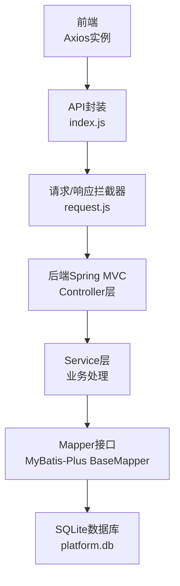
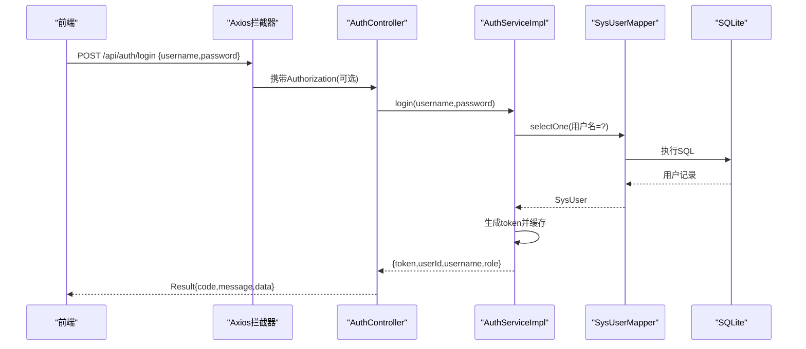
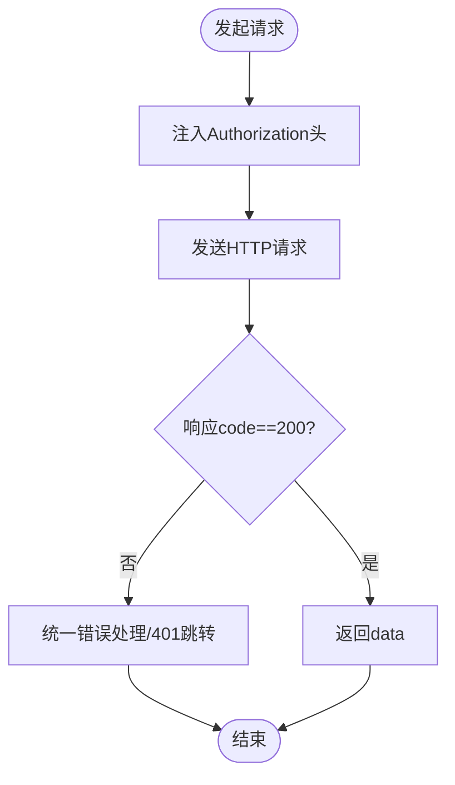
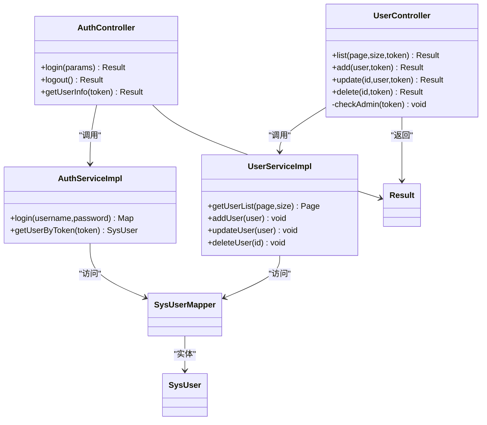
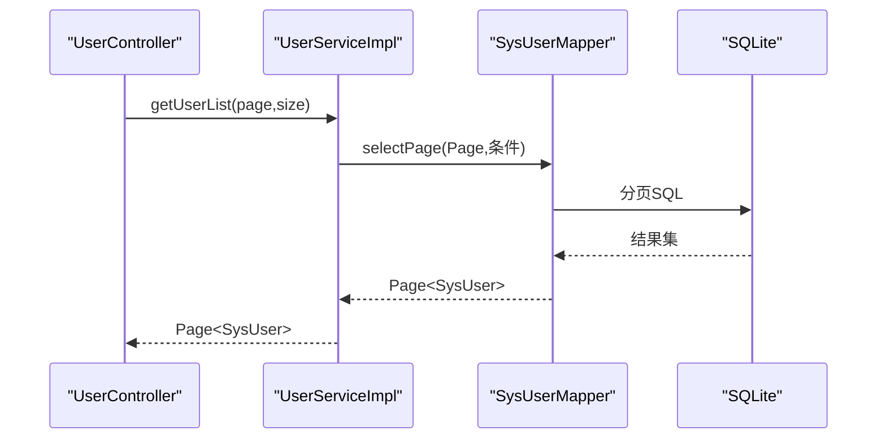
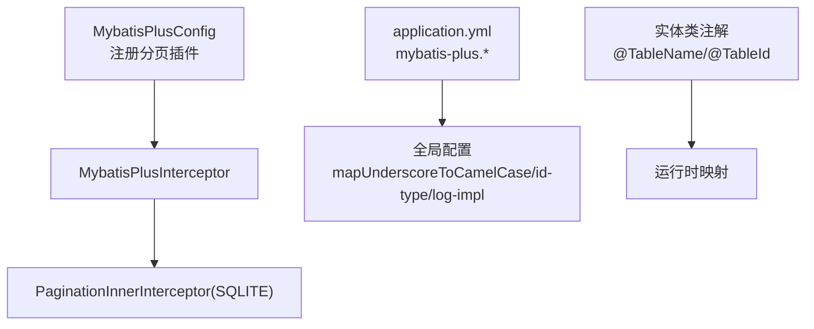
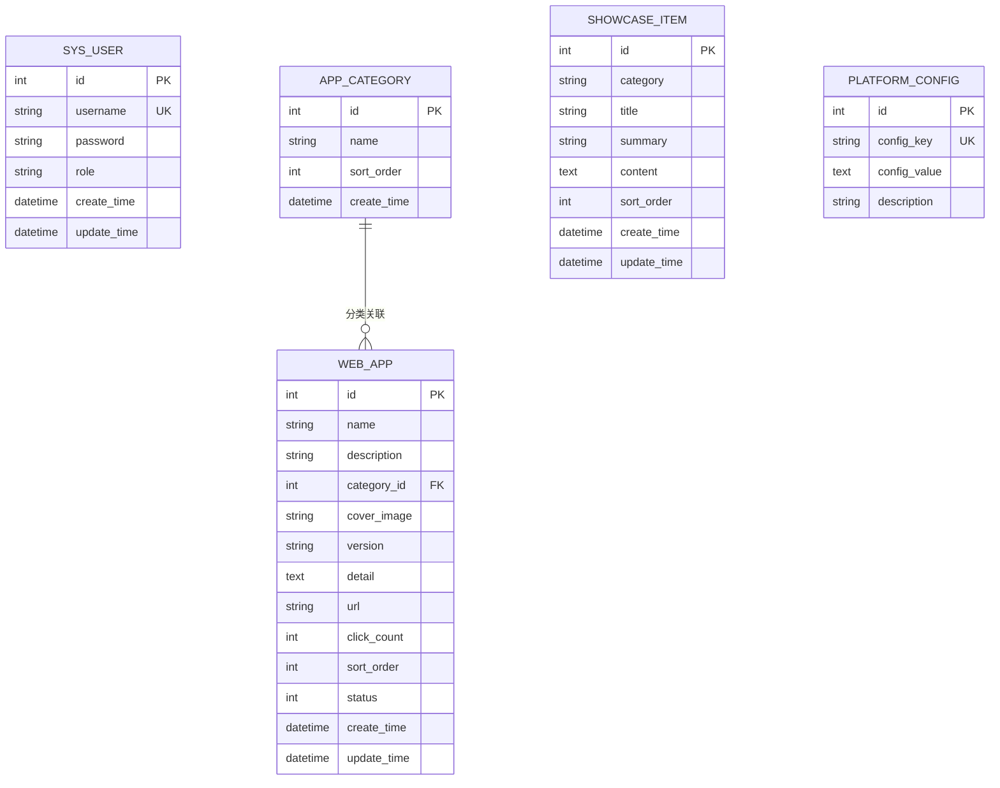
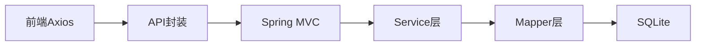

# 数据流设计

<cite>
**本文引用的文件**   
- [frontend/src/api/request.js](file://frontend/src/api/request.js)
- [frontend/src/api/index.js](file://frontend/src/api/index.js)
- [backend/src/main/java/com/xx/platform/controller/AuthController.java](file://backend/src/main/java/com/xx/platform/controller/AuthController.java)
- [backend/src/main/java/com/xx/platform/controller/UserController.java](file://backend/src/main/java/com/xx/platform/controller/UserController.java)
- [backend/src/main/java/com/xx/platform/service/impl/AuthServiceImpl.java](file://backend/src/main/java/com/xx/platform/service/impl/AuthServiceImpl.java)
- [backend/src/main/java/com/xx/platform/service/impl/UserServiceImpl.java](file://backend/src/main/java/com/xx/platform/service/impl/UserServiceImpl.java)
- [backend/src/main/java/com/xx/platform/mapper/SysUserMapper.java](file://backend/src/main/java/com/xx/platform/mapper/SysUserMapper.java)
- [backend/src/main/java/com/xx/platform/entity/SysUser.java](file://backend/src/main/java/com/xx/platform/entity/SysUser.java)
- [backend/src/main/java/com/xx/platform/config/MybatisPlusConfig.java](file://backend/src/main/java/com/xx/platform/config/MybatisPlusConfig.java)
- [backend/src/main/resources/application.yml](file://backend/src/main/resources/application.yml)
- [backend/src/main/resources/schema.sql](file://backend/src/main/resources/schema.sql)
- [backend/src/main/java/com/xx/platform/common/GlobalExceptionHandler.java](file://backend/src/main/java/com/xx/platform/common/GlobalExceptionHandler.java)
- [backend/src/main/java/com/xx/platform/common/Result.java](file://backend/src/main/java/com/xx/platform/common/Result.java)
</cite>

## 目录
1. [引言](#引言)
2. [项目结构](#项目结构)
3. [核心组件](#核心组件)
4. [架构总览](#架构总览)
5. [详细组件分析](#详细组件分析)
6. [依赖分析](#依赖分析)
7. [性能考虑](#性能考虑)
8. [故障排查指南](#故障排查指南)
9. [结论](#结论)
10. [附录](#附录)

## 引言
本文件面向JZPlatform门户系统的数据流设计与实现，覆盖从前端Axios请求到后端Controller、Service、Mapper与数据库的完整链路。重点说明：
- Axios请求拦截器与统一响应处理
- Controller接收参数、鉴权校验与返回封装
- Service业务逻辑与事务边界
- MyBatis-Plus配置与使用（分页、自动填充、逻辑删除等）
- 数据缓存策略与性能优化方案
- 数据一致性保证与事务管理机制
- 数据库连接池配置与SQL优化建议

## 项目结构
前后端分层清晰：
- 前端：基于Vite+Axios，提供统一的API封装与拦截器
- 后端：Spring Boot + MyBatis-Plus + SQLite，按Controller/Service/Mapper/Entity分层组织
- 资源：application.yml配置数据源与MP全局设置；schema.sql初始化表结构与初始数据

图表来源
- [frontend/src/api/request.js:1-45](file://frontend/src/api/request.js#L1-L45)
- [frontend/src/api/index.js:1-137](file://frontend/src/api/index.js#L1-L137)
- [backend/src/main/java/com/xx/platform/controller/AuthController.java:1-68](file://backend/src/main/java/com/xx/platform/controller/AuthController.java#L1-L68)
- [backend/src/main/java/com/xx/platform/controller/UserController.java:1-88](file://backend/src/main/java/com/xx/platform/controller/UserController.java#L1-L88)
- [backend/src/main/java/com/xx/platform/service/impl/AuthServiceImpl.java:1-62](file://backend/src/main/java/com/xx/platform/service/impl/AuthServiceImpl.java#L1-L62)
- [backend/src/main/java/com/xx/platform/service/impl/UserServiceImpl.java:1-53](file://backend/src/main/java/com/xx/platform/service/impl/UserServiceImpl.java#L1-L53)
- [backend/src/main/java/com/xx/platform/mapper/SysUserMapper.java:1-13](file://backend/src/main/java/com/xx/platform/mapper/SysUserMapper.java#L1-L13)
- [backend/src/main/resources/application.yml:1-29](file://backend/src/main/resources/application.yml#L1-L29)
- [backend/src/main/resources/schema.sql:1-80](file://backend/src/main/resources/schema.sql#L1-L80)

章节来源
- [frontend/src/api/request.js:1-45](file://frontend/src/api/request.js#L1-L45)
- [frontend/src/api/index.js:1-137](file://frontend/src/api/index.js#L1-L137)
- [backend/src/main/resources/application.yml:1-29](file://backend/src/main/resources/application.yml#L1-L29)
- [backend/src/main/resources/schema.sql:1-80](file://backend/src/main/resources/schema.sql#L1-L80)

## 核心组件
- 前端Axios实例与拦截器：统一基础路径、超时、Token注入、错误码处理与跳转
- 统一响应体Result：标准code/message/data结构
- 全局异常处理器：捕获运行时异常并转为统一响应
- Controller：路由映射、参数校验、权限检查、调用Service
- Service：业务编排、事务边界、调用Mapper
- Mapper：继承BaseMapper，复用CRUD能力
- MyBatis-Plus配置：分页插件、驼峰映射、日志输出、ID生成策略
- 数据源与文件上传：SQLite驱动、最大上传大小、上传路径

章节来源
- [backend/src/main/java/com/xx/platform/common/Result.java:1-53](file://backend/src/main/java/com/xx/platform/common/Result.java#L1-L53)
- [backend/src/main/java/com/xx/platform/common/GlobalExceptionHandler.java:1-30](file://backend/src/main/java/com/xx/platform/common/GlobalExceptionHandler.java#L1-L30)
- [backend/src/main/java/com/xx/platform/config/MybatisPlusConfig.java:1-27](file://backend/src/main/java/com/xx/platform/config/MybatisPlusConfig.java#L1-L27)
- [backend/src/main/resources/application.yml:1-29](file://backend/src/main/resources/application.yml#L1-L29)

## 架构总览
下图展示一次“用户登录”端到端数据流：前端发起登录请求，经拦截器附加Authorization头，后端AuthController校验参数后交由AuthServiceImpl完成认证与Token生成，再通过SysUserMapper查询用户信息，最终返回统一结果。

图表来源
- [frontend/src/api/request.js:12-22](file://frontend/src/api/request.js#L12-L22)
- [frontend/src/api/index.js:3-16](file://frontend/src/api/index.js#L3-L16)
- [backend/src/main/java/com/xx/platform/controller/AuthController.java:22-37](file://backend/src/main/java/com/xx/platform/controller/AuthController.java#L22-L37)
- [backend/src/main/java/com/xx/platform/service/impl/AuthServiceImpl.java:28-51](file://backend/src/main/java/com/xx/platform/service/impl/AuthServiceImpl.java#L28-L51)
- [backend/src/main/java/com/xx/platform/mapper/SysUserMapper.java:10-12](file://backend/src/main/java/com/xx/platform/mapper/SysUserMapper.java#L10-L12)
- [backend/src/main/resources/application.yml:4-8](file://backend/src/main/resources/application.yml#L4-L8)

## 详细组件分析

### 前端请求与拦截器
- 基础URL与超时：通过axios.create配置baseURL与timeout
- 请求拦截器：从localStorage读取token并注入Authorization头
- 响应拦截器：统一判断code，401时清除本地状态并跳转登录页；非200则抛出错误
- API封装：将各模块接口集中暴露，便于页面调用

图表来源
- [frontend/src/api/request.js:7-10](file://frontend/src/api/request.js#L7-L10)
- [frontend/src/api/request.js:12-22](file://frontend/src/api/request.js#L12-L22)
- [frontend/src/api/request.js:24-42](file://frontend/src/api/request.js#L24-L42)
- [frontend/src/api/index.js:1-16](file://frontend/src/api/index.js#L1-L16)

章节来源
- [frontend/src/api/request.js:1-45](file://frontend/src/api/request.js#L1-L45)
- [frontend/src/api/index.js:1-137](file://frontend/src/api/index.js#L1-L137)

### 后端控制器与鉴权
- AuthController：登录、登出、获取当前用户信息；对info接口进行token校验
- UserController：管理员专用CRUD；在方法内校验token并判断角色为ADMIN
- 统一响应：所有接口返回Result对象，包含code/message/data

图表来源
- [backend/src/main/java/com/xx/platform/controller/AuthController.java:15-67](file://backend/src/main/java/com/xx/platform/controller/AuthController.java#L15-L67)
- [backend/src/main/java/com/xx/platform/controller/UserController.java:15-87](file://backend/src/main/java/com/xx/platform/controller/UserController.java#L15-L87)
- [backend/src/main/java/com/xx/platform/service/impl/AuthServiceImpl.java:19-61](file://backend/src/main/java/com/xx/platform/service/impl/AuthServiceImpl.java#L19-L61)
- [backend/src/main/java/com/xx/platform/service/impl/UserServiceImpl.java:16-52](file://backend/src/main/java/com/xx/platform/service/impl/UserServiceImpl.java#L16-L52)
- [backend/src/main/java/com/xx/platform/mapper/SysUserMapper.java:10-12](file://backend/src/main/java/com/xx/platform/mapper/SysUserMapper.java#L10-L12)
- [backend/src/main/java/com/xx/platform/entity/SysUser.java:13-32](file://backend/src/main/java/com/xx/platform/entity/SysUser.java#L13-L32)
- [backend/src/main/java/com/xx/platform/common/Result.java:9-52](file://backend/src/main/java/com/xx/platform/common/Result.java#L9-L52)

章节来源
- [backend/src/main/java/com/xx/platform/controller/AuthController.java:1-68](file://backend/src/main/java/com/xx/platform/controller/AuthController.java#L1-L68)
- [backend/src/main/java/com/xx/platform/controller/UserController.java:1-88](file://backend/src/main/java/com/xx/platform/controller/UserController.java#L1-L88)
- [backend/src/main/java/com/xx/platform/common/Result.java:1-53](file://backend/src/main/java/com/xx/platform/common/Result.java#L1-L53)

### 服务层与数据访问
- 认证流程：根据用户名密码查询用户，失败抛异常；成功生成UUID作为token，存入内存Map，返回token与用户基本信息
- 用户管理：分页查询、新增前查重、更新更新时间戳、删除操作
- 数据访问：通过SysUserMapper继承BaseMapper获得通用CRUD能力

图表来源
- [backend/src/main/java/com/xx/platform/controller/UserController.java:29-36](file://backend/src/main/java/com/xx/platform/controller/UserController.java#L29-L36)
- [backend/src/main/java/com/xx/platform/service/impl/UserServiceImpl.java:22-27](file://backend/src/main/java/com/xx/platform/service/impl/UserServiceImpl.java#L22-L27)
- [backend/src/main/java/com/xx/platform/mapper/SysUserMapper.java:10-12](file://backend/src/main/java/com/xx/platform/mapper/SysUserMapper.java#L10-L12)

章节来源
- [backend/src/main/java/com/xx/platform/service/impl/AuthServiceImpl.java:1-62](file://backend/src/main/java/com/xx/platform/service/impl/AuthServiceImpl.java#L1-L62)
- [backend/src/main/java/com/xx/platform/service/impl/UserServiceImpl.java:1-53](file://backend/src/main/java/com/xx/platform/service/impl/UserServiceImpl.java#L1-L53)
- [backend/src/main/java/com/xx/platform/mapper/SysUserMapper.java:1-13](file://backend/src/main/java/com/xx/platform/mapper/SysUserMapper.java#L1-L13)

### MyBatis-Plus配置与使用
- 分页插件：注册PaginationInnerInterceptor，适配SQLite方言
- 全局配置：开启下划线转驼峰、输出SQL日志、主键自增策略
- 实体注解：@TableName、@TableId(type=AUTO)等

图表来源
- [backend/src/main/java/com/xx/platform/config/MybatisPlusConfig.java:14-25](file://backend/src/main/java/com/xx/platform/config/MybatisPlusConfig.java#L14-L25)
- [backend/src/main/resources/application.yml:15-24](file://backend/src/main/resources/application.yml#L15-L24)
- [backend/src/main/java/com/xx/platform/entity/SysUser.java:13-18](file://backend/src/main/java/com/xx/platform/entity/SysUser.java#L13-L18)

章节来源
- [backend/src/main/java/com/xx/platform/config/MybatisPlusConfig.java:1-27](file://backend/src/main/java/com/xx/platform/config/MybatisPlusConfig.java#L1-L27)
- [backend/src/main/resources/application.yml:15-24](file://backend/src/main/resources/application.yml#L15-L24)
- [backend/src/main/java/com/xx/platform/entity/SysUser.java:1-33](file://backend/src/main/java/com/xx/platform/entity/SysUser.java#L1-L33)

### 数据模型与关系

图表来源
- [backend/src/main/resources/schema.sql:5-57](file://backend/src/main/resources/schema.sql#L5-L57)

章节来源
- [backend/src/main/resources/schema.sql:1-80](file://backend/src/main/resources/schema.sql#L1-L80)

## 依赖分析
- 前端依赖：axios用于HTTP通信；Vite代理将/api转发至后端
- 后端依赖：Spring Boot Web、MyBatis-Plus、SQLite JDBC、Lombok
- 组件耦合：Controller依赖Service，Service依赖Mapper，Mapper依赖实体；全局异常处理器解耦错误处理

图表来源
- [backend/pom.xml:38-45](file://backend/pom.xml#L38-L45)
- [backend/src/main/resources/application.yml:4-8](file://backend/src/main/resources/application.yml#L4-L8)

章节来源
- [backend/pom.xml:38-45](file://backend/pom.xml#L38-L45)
- [backend/src/main/resources/application.yml:1-29](file://backend/src/main/resources/application.yml#L1-L29)

## 性能考虑
- 分页查询：使用MyBatis-Plus分页插件，避免全表扫描；合理设置page与size
- 索引建议：对高频查询字段建立索引，如sys_user.username、web_app.category_id、showcase_item.category
- 缓存策略：
  - 认证Token：当前使用ConcurrentHashMap内存存储，适合单机内部系统；生产环境建议迁移至Redis以支持多实例共享与过期策略
  - 平台配置：可引入本地缓存或分布式缓存减少频繁读库
- SQL优化：
  - 仅选择必要字段，避免SELECT *
  - 复杂查询拆分或引入视图
  - 批量操作优先使用批量插入/更新
- 连接池：SQLite为单文件数据库，无需传统连接池；若迁移至MySQL/PostgreSQL，建议配置HikariCP并调优最大连接数、空闲超时等

[本节为通用指导，不直接分析具体文件]

## 故障排查指南
- 全局异常处理：RuntimeException与Exception被统一捕获并返回Result.error，便于前端统一提示
- 常见错误定位：
  - 401未授权：前端拦截器会清理本地状态并跳转登录页
  - 业务异常：Service层抛出RuntimeException，由全局异常处理器转换为错误响应
- 调试建议：
  - 开启MyBatis-Plus SQL日志输出，观察实际执行的SQL
  - 检查application.yml中upload路径与权限
  - 确认schema.sql已正确初始化表结构与初始数据

章节来源
- [backend/src/main/java/com/xx/platform/common/GlobalExceptionHandler.java:10-29](file://backend/src/main/java/com/xx/platform/common/GlobalExceptionHandler.java#L10-L29)
- [backend/src/main/java/com/xx/platform/common/Result.java:37-52](file://backend/src/main/java/com/xx/platform/common/Result.java#L37-L52)
- [backend/src/main/resources/application.yml:15-20](file://backend/src/main/resources/application.yml#L15-L20)
- [backend/src/main/resources/schema.sql:59-80](file://backend/src/main/resources/schema.sql#L59-L80)

## 结论
本设计实现了从前端到数据库的清晰数据流：Axios拦截器保障鉴权与错误处理，Controller负责路由与权限校验，Service承载业务逻辑与事务边界，Mapper复用CRUD能力，MyBatis-Plus提供分页与全局配置。结合SQLite与合理的索引与缓存策略，可在小型系统中获得良好的性能与可维护性。后续可按需引入Redis缓存、完善自动填充与逻辑删除、增强事务管理与监控指标。

[本节为总结，不直接分析具体文件]

## 附录

### 关键数据流转要点
- 前端请求：统一baseURL与超时，自动注入Authorization头
- 后端鉴权：Controller内校验token与角色，必要时调用AuthService获取用户信息
- 数据访问：Service层构造查询条件，调用Mapper执行SQL
- 统一响应：Result封装code/message/data，全局异常处理器兜底

章节来源
- [frontend/src/api/request.js:12-22](file://frontend/src/api/request.js#L12-L22)
- [backend/src/main/java/com/xx/platform/controller/UserController.java:78-86](file://backend/src/main/java/com/xx/platform/controller/UserController.java#L78-L86)
- [backend/src/main/java/com/xx/platform/service/impl/UserServiceImpl.java:22-52](file://backend/src/main/java/com/xx/platform/service/impl/UserServiceImpl.java#L22-L52)
- [backend/src/main/java/com/xx/platform/common/Result.java:23-52](file://backend/src/main/java/com/xx/platform/common/Result.java#L23-L52)