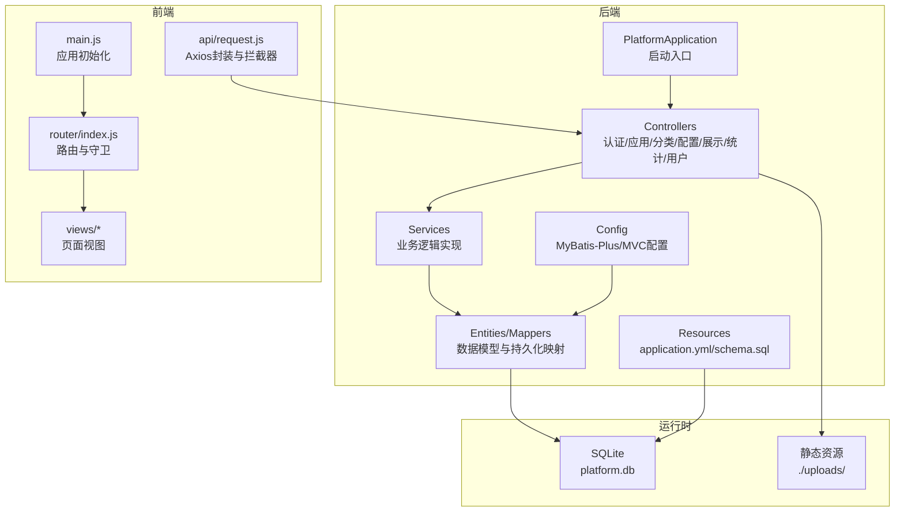
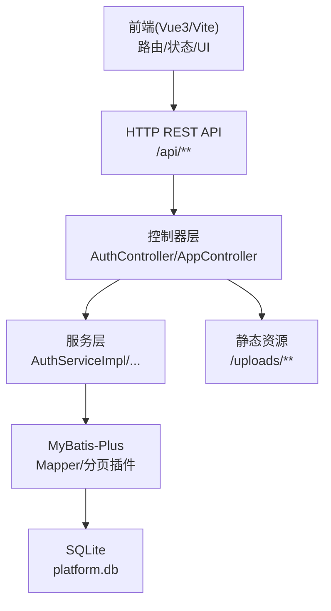
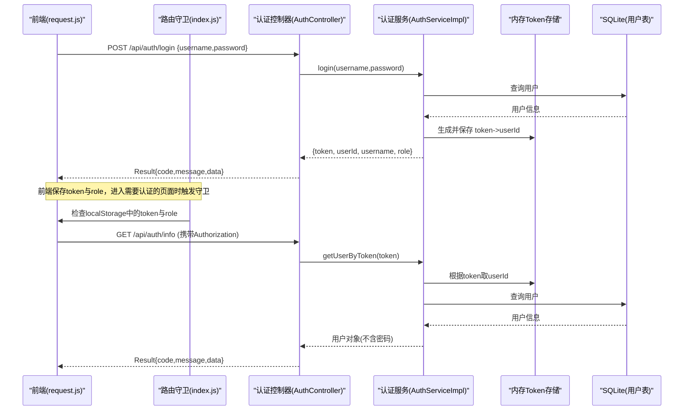
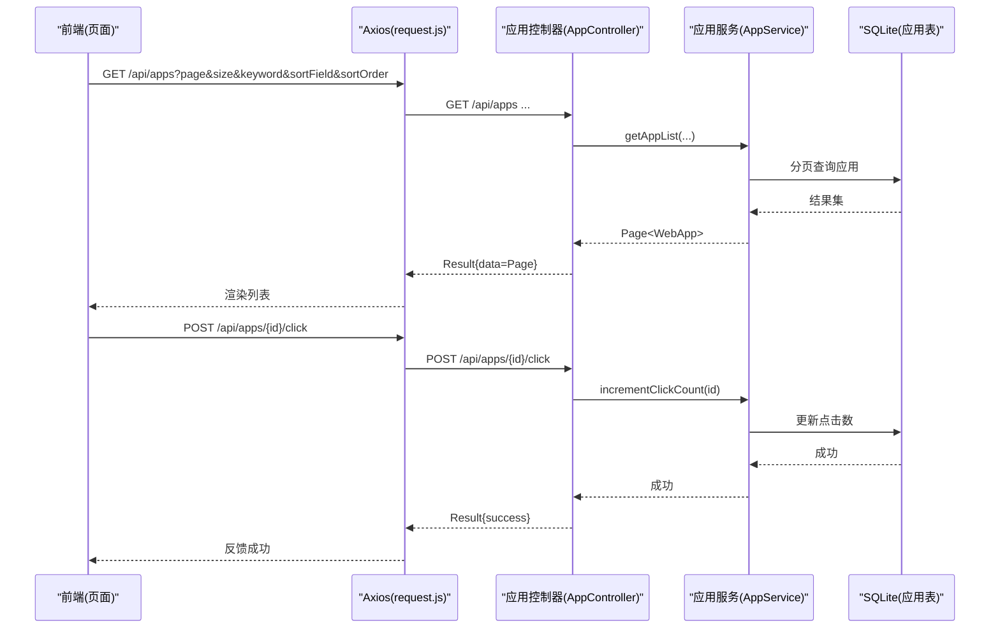
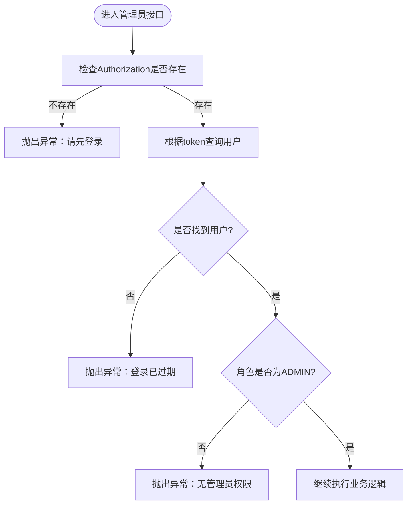
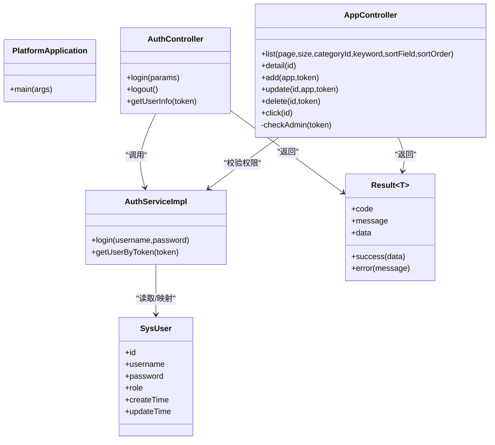
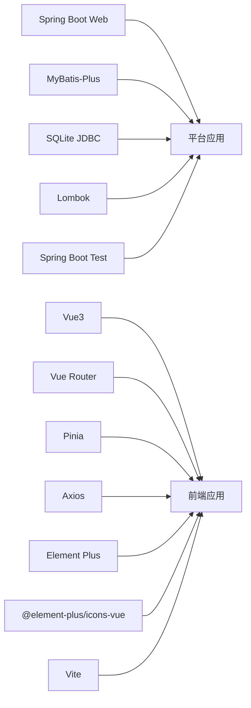

# 整体架构概览

<cite>
**本文引用的文件**   
- [PlatformApplication.java](file://backend/src/main/java/com/xx/platform/PlatformApplication.java)
- [pom.xml](file://backend/pom.xml)
- [application.yml](file://backend/src/main/resources/application.yml)
- [MybatisPlusConfig.java](file://backend/src/main/java/com/xx/platform/config/MybatisPlusConfig.java)
- [WebMvcConfig.java](file://backend/src/main/java/com/xx/platform/config/WebMvcConfig.java)
- [Result.java](file://backend/src/main/java/com/xx/platform/common/Result.java)
- [AuthController.java](file://backend/src/main/java/com/xx/platform/controller/AuthController.java)
- [AppController.java](file://backend/src/main/java/com/xx/platform/controller/AppController.java)
- [AuthServiceImpl.java](file://backend/src/main/java/com/xx/platform/service/impl/AuthServiceImpl.java)
- [SysUser.java](file://backend/src/main/java/com/xx/platform/entity/SysUser.java)
- [API.md](file://API.md)
- [package.json](file://frontend/package.json)
- [main.js](file://frontend/src/main.js)
- [request.js](file://frontend/src/api/request.js)
- [index.js](file://frontend/src/router/index.js)
</cite>

## 目录
1. [简介](#简介)
2. [项目结构](#项目结构)
3. [核心组件](#核心组件)
4. [架构总览](#架构总览)
5. [详细组件分析](#详细组件分析)
6. [依赖分析](#依赖分析)
7. [性能考虑](#性能考虑)
8. [故障排查指南](#故障排查指南)
9. [结论](#结论)
10. [附录](#附录)

## 简介
本文件为JZPlatform门户系统的整体架构概览，面向前后端分离的完整架构模式进行说明。系统采用Spring Boot后端服务、Vue3前端应用与SQLite嵌入式数据库的组合，提供多Web应用导航与产品宣贯能力。文档重点阐述三层架构（表现层、业务层、数据访问层）的职责划分、技术栈选择原因与优势、请求处理流程与组件交互关系，并给出部署架构与环境要求。

## 项目结构
仓库采用前后端分离的组织方式：
- 后端：基于Spring Boot的Java工程，包含控制器、服务实现、实体、Mapper、配置与资源文件；使用Maven管理依赖与构建。
- 前端：基于Vue3 + Vite的工程，包含路由、状态管理、UI组件库、HTTP客户端封装与页面视图。
- 根目录：包含API接口说明文档等辅助资料。

图表来源
- [PlatformApplication.java:1-16](file://backend/src/main/java/com/xx/platform/PlatformApplication.java#L1-L16)
- [application.yml:1-29](file://backend/src/main/resources/application.yml#L1-L29)
- [MybatisPlusConfig.java:1-27](file://backend/src/main/java/com/xx/platform/config/MybatisPlusConfig.java#L1-L27)
- [WebMvcConfig.java:1-37](file://backend/src/main/java/com/xx/platform/config/WebMvcConfig.java#L1-L37)
- [main.js:1-22](file://frontend/src/main.js#L1-L22)
- [index.js:1-99](file://frontend/src/router/index.js#L1-L99)
- [request.js:1-45](file://frontend/src/api/request.js#L1-L45)

章节来源
- [PlatformApplication.java:1-16](file://backend/src/main/java/com/xx/platform/PlatformApplication.java#L1-L16)
- [pom.xml:1-79](file://backend/pom.xml#L1-L79)
- [application.yml:1-29](file://backend/src/main/resources/application.yml#L1-L29)
- [package.json:1-25](file://frontend/package.json#L1-L25)
- [main.js:1-22](file://frontend/src/main.js#L1-L22)
- [index.js:1-99](file://frontend/src/router/index.js#L1-L99)
- [request.js:1-45](file://frontend/src/api/request.js#L1-L45)

## 核心组件
- 统一响应体 Result：为所有接口返回统一的code/message/data结构，便于前后端一致处理。
- 认证控制器 AuthController：提供登录、登出、获取当前用户信息接口，结合令牌校验权限。
- 应用控制器 AppController：提供应用列表、详情、点击记录以及管理员的新增/编辑/删除能力，并在方法内做管理员权限校验。
- 认证服务 AuthServiceImpl：基于内存Map维护Token到用户的映射，完成登录鉴权与按Token查询用户。
- 用户实体 SysUser：定义用户表结构与字段映射，配合MyBatis-Plus进行CRUD操作。
- MyBatis-Plus配置 MybatisPlusConfig：注册分页插件，适配SQLite方言。
- Web MVC配置 WebMvcConfig：开启CORS跨域与上传文件静态资源映射。
- 前端请求封装 request.js：Axios实例统一基础路径、超时、请求头注入token、响应错误统一处理与未授权跳转。
- 前端路由 index.js：定义页面路由与后台管理子路由，并提供路由守卫进行登录态与角色校验。
- 应用入口 main.js：创建Vue应用，注册Pinia、Router、Element Plus及图标，挂载到DOM。

章节来源
- [Result.java:1-53](file://backend/src/main/java/com/xx/platform/common/Result.java#L1-L53)
- [AuthController.java:1-68](file://backend/src/main/java/com/xx/platform/controller/AuthController.java#L1-L68)
- [AppController.java:1-111](file://backend/src/main/java/com/xx/platform/controller/AppController.java#L1-L111)
- [AuthServiceImpl.java:1-62](file://backend/src/main/java/com/xx/platform/service/impl/AuthServiceImpl.java#L1-L62)
- [SysUser.java:1-33](file://backend/src/main/java/com/xx/platform/entity/SysUser.java#L1-L33)
- [MybatisPlusConfig.java:1-27](file://backend/src/main/java/com/xx/platform/config/MybatisPlusConfig.java#L1-L27)
- [WebMvcConfig.java:1-37](file://backend/src/main/java/com/xx/platform/config/WebMvcConfig.java#L1-L37)
- [request.js:1-45](file://frontend/src/api/request.js#L1-L45)
- [index.js:1-99](file://frontend/src/router/index.js#L1-L99)
- [main.js:1-22](file://frontend/src/main.js#L1-L22)

## 架构总览
系统采用前后端分离的三层架构：
- 表现层（前端）：Vue3 + Vue Router + Pinia + Element Plus，负责页面渲染、路由控制、状态管理与用户交互。通过Axios调用后端REST API。
- 业务层（后端）：Spring Boot Controller接收请求，Service实现业务逻辑，必要时进行权限校验与参数处理。
- 数据访问层（后端）：MyBatis-Plus Mapper对接SQLite数据库，完成数据持久化与分页查询。

图表来源
- [AuthController.java:1-68](file://backend/src/main/java/com/xx/platform/controller/AuthController.java#L1-L68)
- [AppController.java:1-111](file://backend/src/main/java/com/xx/platform/controller/AppController.java#L1-L111)
- [AuthServiceImpl.java:1-62](file://backend/src/main/java/com/xx/platform/service/impl/AuthServiceImpl.java#L1-L62)
- [MybatisPlusConfig.java:1-27](file://backend/src/main/java/com/xx/platform/config/MybatisPlusConfig.java#L1-L27)
- [WebMvcConfig.java:1-37](file://backend/src/main/java/com/xx/platform/config/WebMvcConfig.java#L1-L37)
- [application.yml:1-29](file://backend/src/main/resources/application.yml#L1-L29)

## 详细组件分析

### 认证流程（登录与鉴权）
该流程展示了从前端发起登录到后端验证并返回令牌，再到后续受保护接口的鉴权过程。

图表来源
- [AuthController.java:1-68](file://backend/src/main/java/com/xx/platform/controller/AuthController.java#L1-L68)
- [AuthServiceImpl.java:1-62](file://backend/src/main/java/com/xx/platform/service/impl/AuthServiceImpl.java#L1-L62)
- [SysUser.java:1-33](file://backend/src/main/java/com/xx/platform/entity/SysUser.java#L1-L33)
- [request.js:1-45](file://frontend/src/api/request.js#L1-L45)
- [index.js:1-99](file://frontend/src/router/index.js#L1-L99)

章节来源
- [AuthController.java:1-68](file://backend/src/main/java/com/xx/platform/controller/AuthController.java#L1-L68)
- [AuthServiceImpl.java:1-62](file://backend/src/main/java/com/xx/platform/service/impl/AuthServiceImpl.java#L1-L62)
- [SysUser.java:1-33](file://backend/src/main/java/com/xx/platform/entity/SysUser.java#L1-L33)
- [request.js:1-45](file://frontend/src/api/request.js#L1-L45)
- [index.js:1-99](file://frontend/src/router/index.js#L1-L99)

### 应用管理（列表与点击）
该流程展示了公开的应用列表查询与点击计数记录的端到端调用。

图表来源
- [AppController.java:1-111](file://backend/src/main/java/com/xx/platform/controller/AppController.java#L1-L111)
- [application.yml:1-29](file://backend/src/main/resources/application.yml#L1-L29)
- [request.js:1-45](file://frontend/src/api/request.js#L1-L45)

章节来源
- [AppController.java:1-111](file://backend/src/main/java/com/xx/platform/controller/AppController.java#L1-L111)
- [application.yml:1-29](file://backend/src/main/resources/application.yml#L1-L29)
- [request.js:1-45](file://frontend/src/api/request.js#L1-L45)

### 权限校验（管理员）
管理员操作的权限校验在控制器中直接完成，确保只有具备ADMIN角色的用户可执行敏感操作。

图表来源
- [AppController.java:98-110](file://backend/src/main/java/com/xx/platform/controller/AppController.java#L98-L110)
- [AuthController.java:55-66](file://backend/src/main/java/com/xx/platform/controller/AuthController.java#L55-L66)
- [AuthServiceImpl.java:53-60](file://backend/src/main/java/com/xx/platform/service/impl/AuthServiceImpl.java#L53-L60)

章节来源
- [AppController.java:98-110](file://backend/src/main/java/com/xx/platform/controller/AppController.java#L98-L110)
- [AuthController.java:55-66](file://backend/src/main/java/com/xx/platform/controller/AuthController.java#L55-L66)
- [AuthServiceImpl.java:53-60](file://backend/src/main/java/com/xx/platform/service/impl/AuthServiceImpl.java#L53-L60)

### 类关系图（关键后端类）

图表来源
- [PlatformApplication.java:1-16](file://backend/src/main/java/com/xx/platform/PlatformApplication.java#L1-L16)
- [AuthController.java:1-68](file://backend/src/main/java/com/xx/platform/controller/AuthController.java#L1-L68)
- [AppController.java:1-111](file://backend/src/main/java/com/xx/platform/controller/AppController.java#L1-L111)
- [AuthServiceImpl.java:1-62](file://backend/src/main/java/com/xx/platform/service/impl/AuthServiceImpl.java#L1-L62)
- [SysUser.java:1-33](file://backend/src/main/java/com/xx/platform/entity/SysUser.java#L1-L33)
- [Result.java:1-53](file://backend/src/main/java/com/xx/platform/common/Result.java#L1-L53)

## 依赖分析
- 后端依赖
  - Spring Boot Starter Web：提供Web容器与REST支持。
  - MyBatis-Plus：简化CRUD与分页，内置SQLite方言支持。
  - SQLite JDBC驱动：嵌入式数据库连接。
  - Lombok：减少样板代码。
  - Spring Boot Test：测试支持。
- 前端依赖
  - Vue3、Vue Router、Pinia：框架、路由与状态管理。
  - Axios：HTTP客户端。
  - Element Plus与图标库：UI组件与图标。
  - Vite与插件：开发与构建工具链。

图表来源
- [pom.xml:26-60](file://backend/pom.xml#L26-L60)
- [package.json:11-23](file://frontend/package.json#L11-L23)

章节来源
- [pom.xml:1-79](file://backend/pom.xml#L1-L79)
- [package.json:1-25](file://frontend/package.json#L1-L25)

## 性能考虑
- 数据库
  - SQLite适合单机与轻量场景，注意并发写入限制与事务粒度控制。
  - 合理设计索引与查询条件，避免全表扫描；对高频查询字段建立索引。
  - 利用MyBatis-Plus分页插件进行分页查询，降低数据传输量。
- 缓存
  - 当前认证使用内存Map存储Token，适合内部小流量场景；生产环境建议迁移至Redis以支持分布式与过期策略。
- 网络与I/O
  - 前端设置合理的超时时间，避免长时间阻塞。
  - 静态资源（如上传文件）通过Nginx或反向代理缓存提升访问速度。
- 构建与打包
  - 前端按需引入Element Plus组件与图标，减小包体积。
  - 后端使用Spring Boot Maven插件打包，排除Lombok编译期依赖。

[本节为通用指导，不直接分析具体文件]

## 故障排查指南
- 登录失败
  - 检查用户名与密码是否正确，确认数据库中用户记录存在且匹配。
  - 查看后端日志输出，定位认证服务抛出的异常信息。
- 未授权/登录过期
  - 前端响应拦截器会在code为401时清除本地token并跳转登录页，检查Authorization头是否正确传递。
  - 服务端根据token查询用户为空时返回未登录或过期提示。
- 跨域问题
  - 开发环境下需确保后端CORS允许前端域名与方法，检查WebMvcConfig配置。
- 静态资源无法访问
  - 确认上传文件路径映射正确，访问/uploads/**前缀的资源是否位于配置的物理目录。
- 分页异常
  - 确认MyBatis-Plus分页插件已启用且数据库类型为SQLite，避免方言不匹配导致SQL错误。

章节来源
- [AuthController.java:55-66](file://backend/src/main/java/com/xx/platform/controller/AuthController.java#L55-L66)
- [AuthServiceImpl.java:29-51](file://backend/src/main/java/com/xx/platform/service/impl/AuthServiceImpl.java#L29-L51)
- [request.js:24-42](file://frontend/src/api/request.js#L24-L42)
- [WebMvcConfig.java:18-35](file://backend/src/main/java/com/xx/platform/config/WebMvcConfig.java#L18-L35)
- [MybatisPlusConfig.java:20-25](file://backend/src/main/java/com/xx/platform/config/MybatisPlusConfig.java#L20-L25)

## 结论
JZPlatform门户系统采用清晰的前后端分离与三层架构，借助Spring Boot、Vue3与MyBatis-Plus快速构建稳定可靠的业务功能。SQLite作为嵌入式数据库降低了部署复杂度，适合内部系统与演示环境。通过统一的响应体与前端拦截器，提升了前后端协作效率与用户体验。建议在后续演进中完善安全机制（如密码加密、JWT有效期）、引入分布式缓存与更完善的监控与审计能力。

[本节为总结性内容，不直接分析具体文件]

## 附录

### 技术栈选择与优势
- Spring Boot
  - 约定优于配置，快速搭建REST服务；生态丰富，易于集成第三方组件。
- Vue3 + Vite
  - 现代前端开发体验，热重载与高效构建；组合式API提升组件复用与可维护性。
- MyBatis-Plus
  - 简化CRUD与分页，内置多种数据库方言，提高开发效率。
- SQLite
  - 零配置、单文件数据库，适合单机与轻量场景，便于打包与分发。
- Element Plus
  - 丰富的企业级UI组件，加速后台管理系统界面开发。

[本节为通用说明，不直接分析具体文件]

### 部署架构与环境要求
- 运行环境
  - Java 8及以上（由后端pom.xml指定）。
  - Node.js与npm/yarn用于前端开发与构建。
- 后端
  - 端口：默认8080（application.yml）。
  - 数据库：SQLite文件platform.db（自动创建）。
  - 静态资源：./uploads/目录用于存放上传文件，并通过/uploads/**对外暴露。
- 前端
  - 开发服务器：默认5173端口（Vite），通过代理将/api转发到后端8080。
  - 构建产物：dist目录，可部署至任意静态服务器或通过Nginx反代。
- 启动方式
  - 后端：mvn spring-boot:run
  - 前端：npm install && npm run dev

章节来源
- [application.yml:1-29](file://backend/src/main/resources/application.yml#L1-L29)
- [API.md:180-197](file://API.md#L180-L197)
- [package.json:6-23](file://frontend/package.json#L6-L23)