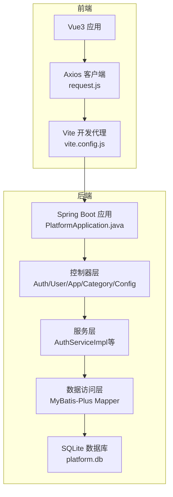
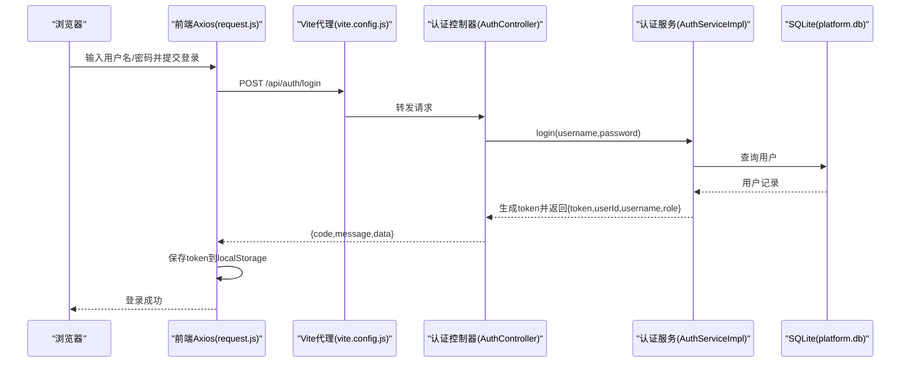
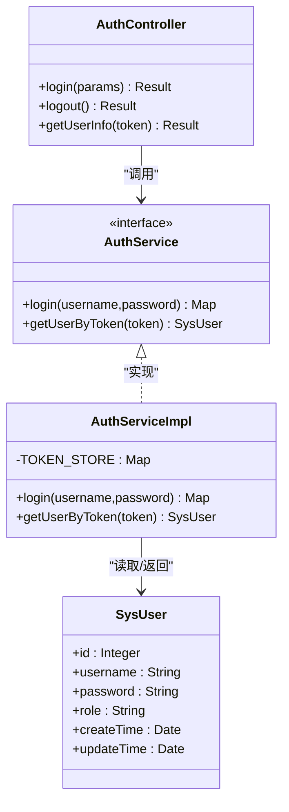
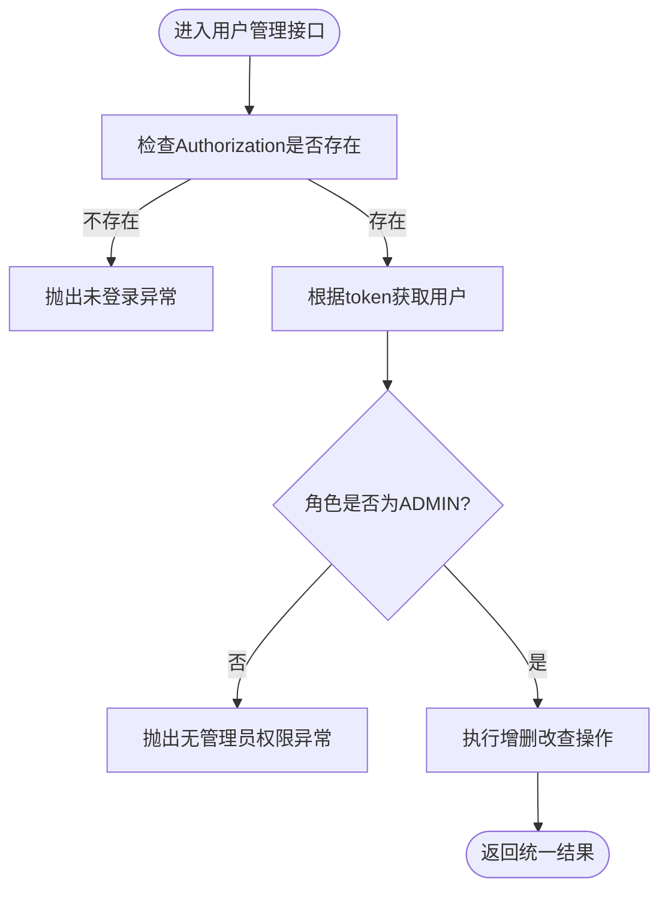
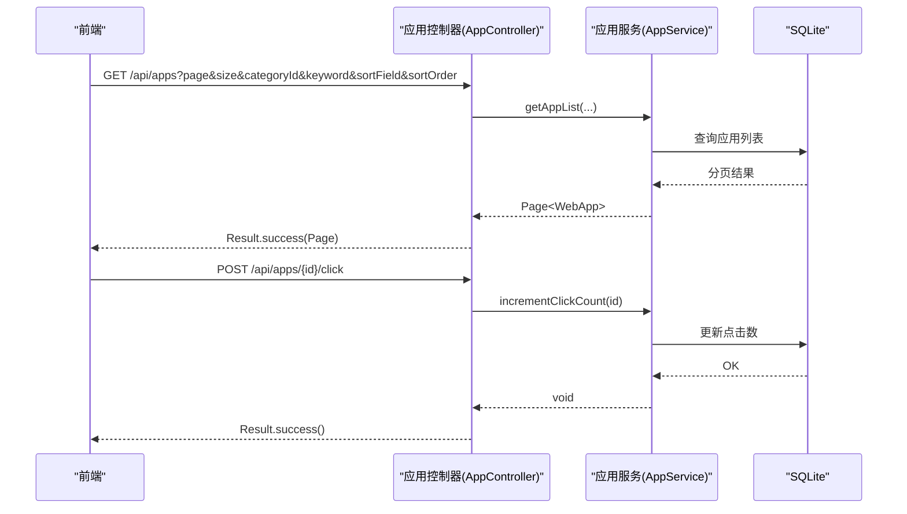
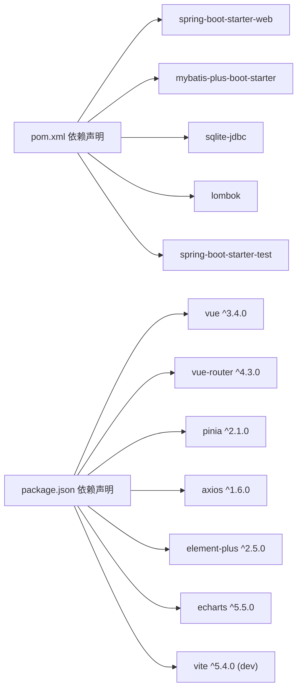
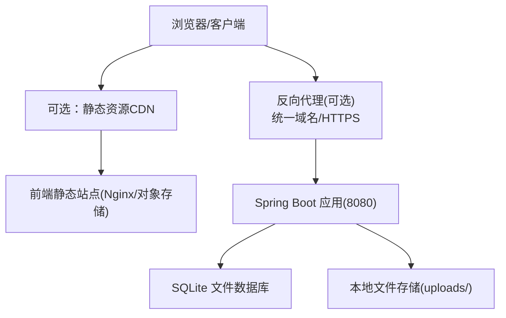

# 系统架构设计

<cite>
**本文引用的文件**   
- [PlatformApplication.java](file://backend/src/main/java/com/xx/platform/PlatformApplication.java)
- [pom.xml](file://backend/pom.xml)
- [application.yml](file://backend/src/main/resources/application.yml)
- [AuthController.java](file://backend/src/main/java/com/xx/platform/controller/AuthController.java)
- [UserController.java](file://backend/src/main/java/com/xx/platform/controller/UserController.java)
- [AppController.java](file://backend/src/main/java/com/xx/platform/controller/AppController.java)
- [CategoryController.java](file://backend/src/main/java/com/xx/platform/controller/CategoryController.java)
- [ConfigController.java](file://backend/src/main/java/com/xx/platform/controller/ConfigController.java)
- [AuthService.java](file://backend/src/main/java/com/xx/platform/service/AuthService.java)
- [AuthServiceImpl.java](file://backend/src/main/java/com/xx/platform/service/impl/AuthServiceImpl.java)
- [SysUser.java](file://backend/src/main/java/com/xx/platform/entity/SysUser.java)
- [request.js](file://frontend/src/api/request.js)
- [vite.config.js](file://frontend/vite.config.js)
- [API.md](file://API.md)
</cite>

## 目录
1. [引言](#引言)
2. [项目结构](#项目结构)
3. [核心组件](#核心组件)
4. [架构总览](#架构总览)
5. [详细组件分析](#详细组件分析)
6. [依赖关系分析](#依赖关系分析)
7. [性能考虑](#性能考虑)
8. [故障排查指南](#故障排查指南)
9. [结论](#结论)
10. [附录](#附录)

## 引言
本文件为JZPlatform门户系统的系统架构设计文档，面向前后端分离的Spring Boot后端与Vue3前端。文档覆盖MVC分层、RESTful API规范、数据流向与组件交互、技术决策与权衡、基础设施要求、可扩展性与部署拓扑，以及横切关注点（安全性、监控、灾难恢复）和第三方依赖与版本兼容性说明。

## 项目结构
- 后端采用Spring Boot 2.7 + MyBatis-Plus + SQLite，按controller/service/mapper/entity分层组织；统一响应体Result与全局异常处理贯穿全栈。
- 前端基于Vue3 + Vue Router + Pinia + Axios + Element Plus，通过Vite开发服务器代理将/api请求转发至后端。
- 配置集中在application.yml与vite.config.js中，API契约由API.md维护。

图表来源
- [PlatformApplication.java:1-16](file://backend/src/main/java/com/xx/platform/PlatformApplication.java#L1-L16)
- [AuthController.java:1-68](file://backend/src/main/java/com/xx/platform/controller/AuthController.java#L1-L68)
- [AuthServiceImpl.java:1-62](file://backend/src/main/java/com/xx/platform/service/impl/AuthServiceImpl.java#L1-L62)
- [request.js:1-45](file://frontend/src/api/request.js#L1-L45)
- [vite.config.js:1-20](file://frontend/vite.config.js#L1-L20)

章节来源
- [PlatformApplication.java:1-16](file://backend/src/main/java/com/xx/platform/PlatformApplication.java#L1-L16)
- [application.yml:1-29](file://backend/src/main/resources/application.yml#L1-L29)
- [API.md:1-197](file://API.md#L1-L197)
- [vite.config.js:1-20](file://frontend/vite.config.js#L1-L20)

## 核心组件
- 启动入口：Spring Boot主类负责应用初始化与Web容器启动。
- 控制器层：认证、用户管理、应用管理、分类管理、平台配置等REST接口。
- 服务层：业务逻辑封装，当前认证服务使用内存Token存储。
- 数据访问层：MyBatis-Plus Mapper对接SQLite。
- 前端：Axios拦截器统一注入Authorization头并处理401跳转；Vite代理转发/api与/uploads到后端。

章节来源
- [AuthController.java:1-68](file://backend/src/main/java/com/xx/platform/controller/AuthController.java#L1-L68)
- [UserController.java:1-88](file://backend/src/main/java/com/xx/platform/controller/UserController.java#L1-L88)
- [AppController.java:1-111](file://backend/src/main/java/com/xx/platform/controller/AppController.java#L1-L111)
- [CategoryController.java:1-78](file://backend/src/main/java/com/xx/platform/controller/CategoryController.java#L1-L78)
- [ConfigController.java:1-76](file://backend/src/main/java/com/xx/platform/controller/ConfigController.java#L1-L76)
- [AuthService.java:1-27](file://backend/src/main/java/com/xx/platform/service/AuthService.java#L1-L27)
- [AuthServiceImpl.java:1-62](file://backend/src/main/java/com/xx/platform/service/impl/AuthServiceImpl.java#L1-L62)
- [SysUser.java:1-33](file://backend/src/main/java/com/xx/platform/entity/SysUser.java#L1-L33)
- [request.js:1-45](file://frontend/src/api/request.js#L1-L45)

## 架构总览
整体采用前后端分离架构：
- 前端静态资源与路由由Vue3/Vite提供，通过Axios调用后端REST API。
- 后端以Spring Boot提供REST服务，遵循MVC分层，统一返回Result格式。
- 认证采用无状态Token（内存存储），前端在请求头携带Authorization。
- 开发期通过Vite代理将/api与/uploads转发至后端8080端口。

图表来源
- [AuthController.java:22-66](file://backend/src/main/java/com/xx/platform/controller/AuthController.java#L22-L66)
- [AuthServiceImpl.java:28-51](file://backend/src/main/java/com/xx/platform/service/impl/AuthServiceImpl.java#L28-L51)
- [request.js:12-22](file://frontend/src/api/request.js#L12-L22)
- [vite.config.js:6-18](file://frontend/vite.config.js#L6-L18)

## 详细组件分析

### 认证与安全
- 登录流程：前端提交凭据，后端校验后生成UUID作为token并建立内存映射，返回token与用户基本信息。
- 鉴权方式：后续请求需携带Authorization头，控制器在服务层根据token解析用户信息并进行角色校验（ADMIN）。
- 安全建议：生产环境应替换内存Token为Redis或JWT持久化方案，增加过期策略与刷新机制；对密码进行哈希存储与传输加密。

图表来源
- [AuthController.java:1-68](file://backend/src/main/java/com/xx/platform/controller/AuthController.java#L1-L68)
- [AuthService.java:1-27](file://backend/src/main/java/com/xx/platform/service/AuthService.java#L1-L27)
- [AuthServiceImpl.java:1-62](file://backend/src/main/java/com/xx/platform/service/impl/AuthServiceImpl.java#L1-L62)
- [SysUser.java:1-33](file://backend/src/main/java/com/xx/platform/entity/SysUser.java#L1-L33)

章节来源
- [AuthController.java:22-66](file://backend/src/main/java/com/xx/platform/controller/AuthController.java#L22-L66)
- [AuthServiceImpl.java:28-60](file://backend/src/main/java/com/xx/platform/service/impl/AuthServiceImpl.java#L28-L60)
- [request.js:12-42](file://frontend/src/api/request.js#L12-L42)

### 用户管理（管理员）
- 能力：分页列表、新增、编辑、删除；所有操作均要求ADMIN角色。
- 权限校验：控制器内checkAdmin方法从Authorization头解析用户并校验角色。

图表来源
- [UserController.java:75-86](file://backend/src/main/java/com/xx/platform/controller/UserController.java#L75-L86)

章节来源
- [UserController.java:25-86](file://backend/src/main/java/com/xx/platform/controller/UserController.java#L25-L86)

### Web应用管理
- 公开接口：应用列表（支持分页、筛选、排序）、详情、点击计数。
- 管理员接口：新增、编辑、删除；同样需要ADMIN角色校验。

图表来源
- [AppController.java:27-96](file://backend/src/main/java/com/xx/platform/controller/AppController.java#L27-L96)

章节来源
- [AppController.java:27-110](file://backend/src/main/java/com/xx/platform/controller/AppController.java#L27-L110)

### 分类管理与平台配置
- 分类管理：公开获取分类列表；管理员可新增、编辑、删除。
- 平台配置：公开获取全部配置；管理员批量更新配置与上传文件（Logo/底图），文件路径写入配置项。

章节来源
- [CategoryController.java:26-76](file://backend/src/main/java/com/xx/platform/controller/CategoryController.java#L26-L76)
- [ConfigController.java:33-74](file://backend/src/main/java/com/xx/platform/controller/ConfigController.java#L33-L74)

### 前端请求与代理
- Axios实例设置baseURL为/api，并在请求拦截器自动附加Authorization头；响应拦截器统一处理错误码与401跳转。
- Vite开发服务器将/api与/uploads代理到http://localhost:8080，便于本地联调。

章节来源
- [request.js:1-45](file://frontend/src/api/request.js#L1-45)
- [vite.config.js:1-20](file://frontend/vite.config.js#L1-20)

## 依赖关系分析
- 后端依赖：Spring Boot Starter Web、MyBatis-Plus、SQLite JDBC、Lombok、Spring Boot Test。
- 前端依赖：Vue3、Vue Router、Pinia、Axios、Element Plus、ECharts、Vite及Vue插件。

图表来源
- [pom.xml:26-60](file://backend/pom.xml#L26-L60)
- [package.json:11-23](file://frontend/package.json#L11-L23)

章节来源
- [pom.xml:1-79](file://backend/pom.xml#L1-L79)
- [package.json:1-25](file://frontend/package.json#L1-L25)

## 性能考虑
- 数据库：SQLite适合单机与轻量场景；高并发下应考虑迁移至MySQL/PostgreSQL并引入连接池与索引优化。
- 认证：当前内存Token不适合多实例部署，建议替换为Redis集中式会话或无状态JWT，结合过期与黑名单机制。
- 缓存：热点数据（如分类、配置、统计概览）可引入本地缓存或分布式缓存以降低数据库压力。
- I/O：文件上传路径与大小限制已在配置中体现，生产环境建议接入对象存储（如S3/MinIO）并启用CDN加速。
- 前端：按需加载与懒路由可减少首屏体积；图片与静态资源走CDN提升加载速度。

[本节为通用指导，不直接分析具体文件]

## 故障排查指南
- 401未授权：前端拦截器会在响应码为401时清除本地token并跳转登录页；检查Authorization头是否正确传递与后端token是否有效。
- 权限不足：管理员接口会校验角色，若返回“无管理员权限”，请确认当前用户角色为ADMIN。
- 文件上传失败：检查文件大小限制与上传路径权限；确认fileKey参数合法（logo_path/bg_image）。
- 跨域问题：开发期通过Vite代理解决；生产部署需确保同源或正确配置CORS。

章节来源
- [request.js:24-42](file://frontend/src/api/request.js#L24-L42)
- [UserController.java:75-86](file://backend/src/main/java/com/xx/platform/controller/UserController.java#L75-L86)
- [ConfigController.java:57-68](file://backend/src/main/java/com/xx/platform/controller/ConfigController.java#L57-L68)
- [application.yml:9-13](file://backend/src/main/resources/application.yml#L9-L13)

## 结论
JZPlatform门户采用清晰的前后端分离与MVC分层，API契约明确、统一响应体与拦截器简化了前后端协作。当前实现满足内部系统与演示场景，生产化需重点完善认证持久化、权限模型、文件存储与监控告警能力。

[本节为总结性内容，不直接分析具体文件]

## 附录

### 技术栈与版本兼容性
- 后端
  - Java 1.8
  - Spring Boot 2.7.17
  - MyBatis-Plus 3.5.3.1
  - SQLite JDBC 3.39.3.0
  - Lombok（编译期注解）
- 前端
  - Vue 3.4.x
  - Vue Router 4.3.x
  - Pinia 2.1.x
  - Axios 1.6.x
  - Element Plus 2.5.x
  - ECharts 5.5.x
  - Vite 5.4.x（开发构建）

章节来源
- [pom.xml:21-45](file://backend/pom.xml#L21-L45)
- [package.json:11-23](file://frontend/package.json#L11-L23)

### 基础设施要求
- 运行环境
  - JDK 1.8+
  - Node.js 18+（前端开发与构建）
- 运行时
  - 单进程即可运行后端（内置Tomcat）
  - 开发期使用Vite开发服务器；生产期将前端静态资源与后端打包部署于同一域名下或通过反向代理合并
- 存储
  - SQLite文件数据库（默认platform.db）
  - 本地文件上传目录（./uploads/）

章节来源
- [application.yml:1-29](file://backend/src/main/resources/application.yml#L1-L29)

### 部署拓扑（概念）

[此图为概念性拓扑，不直接映射具体源码文件]

### RESTful API设计规范
- 基础URL：/api
- 认证：请求头Authorization携带token
- 统一响应：{ code, message, data }
- 分页：page/size参数
- 权限：管理员接口需ADMIN角色

章节来源
- [API.md:1-197](file://API.md#L1-L197)