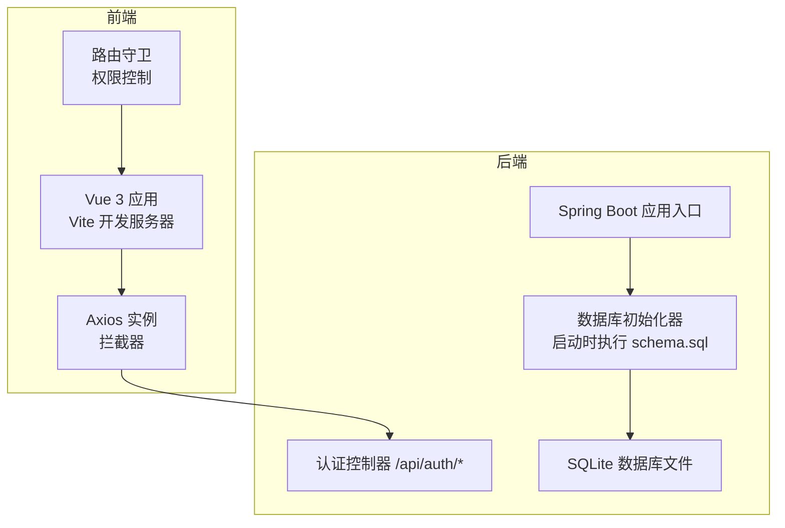
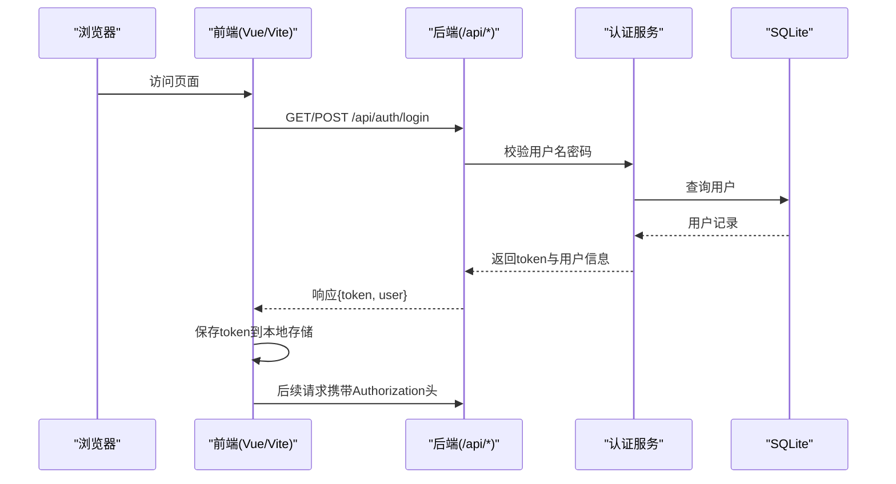
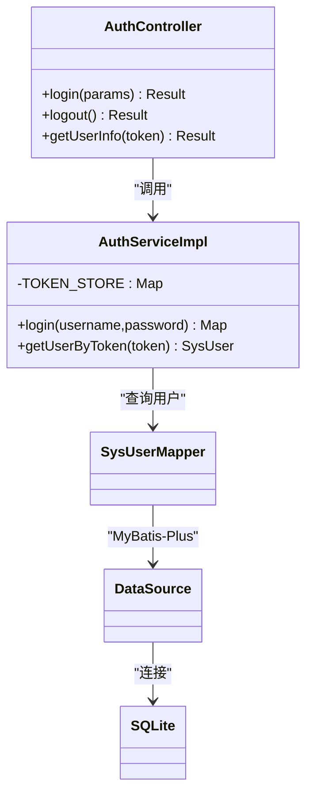
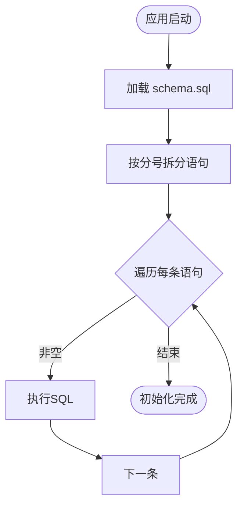
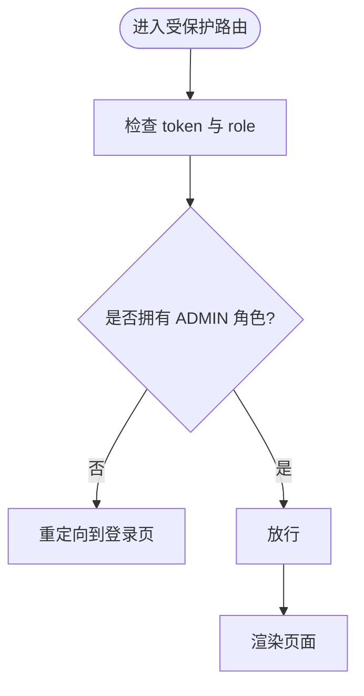
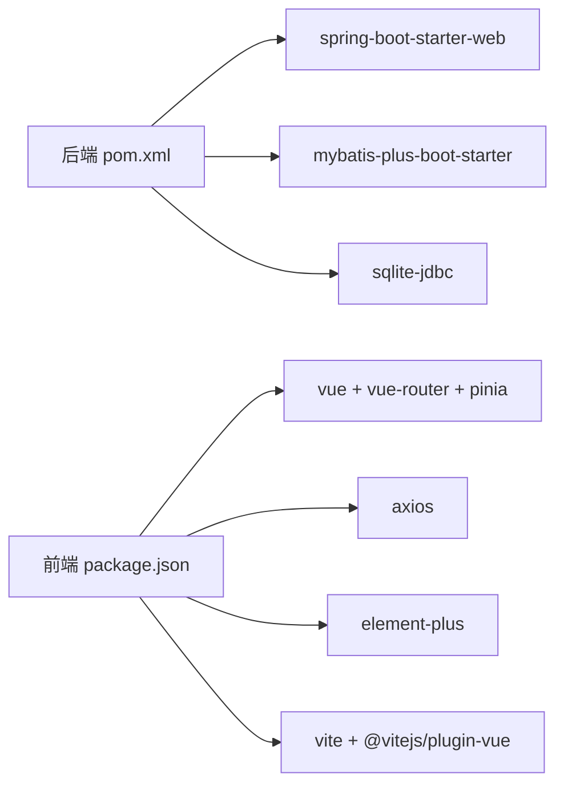

# 部署指南

<cite>
**本文引用的文件**   
- [application.yml](file://backend/src/main/resources/application.yml)
- [pom.xml](file://backend/pom.xml)
- [PlatformApplication.java](file://backend/src/main/java/com/xx/platform/PlatformApplication.java)
- [DatabaseInitializer.java](file://backend/src/main/java/com/xx/platform/config/DatabaseInitializer.java)
- [schema.sql](file://backend/src/main/resources/schema.sql)
- [AuthController.java](file://backend/src/main/java/com/xx/platform/controller/AuthController.java)
- [AuthServiceImpl.java](file://backend/src/main/java/com/xx/platform/service/impl/AuthServiceImpl.java)
- [package.json](file://frontend/package.json)
- [vite.config.js](file://frontend/vite.config.js)
- [request.js](file://frontend/src/api/request.js)
- [index.js](file://frontend/src/router/index.js)
</cite>

## 目录
1. [简介](#简介)
2. [项目结构](#项目结构)
3. [核心组件](#核心组件)
4. [架构总览](#架构总览)
5. [详细组件分析](#详细组件分析)
6. [依赖分析](#依赖分析)
7. [性能考虑](#性能考虑)
8. [故障排查指南](#故障排查指南)
9. [结论](#结论)
10. [附录](#附录)

## 简介
本指南面向JZPlatform门户系统的开发与生产部署，覆盖前后端构建、依赖管理、环境变量与配置、Docker容器化、负载均衡、数据库备份策略、监控日志、性能调优、安全加固、CI/CD流水线与自动化发布等主题。文档以仓库现有实现为依据，提供可操作的步骤与最佳实践建议。

## 项目结构
后端采用Spring Boot（Java 8）+ MyBatis-Plus + SQLite；前端采用Vue 3 + Vite + Element Plus。开发期通过Vite代理将API请求转发至后端服务。

图表来源
- [vite.config.js:1-20](file://frontend/vite.config.js#L1-L20)
- [request.js:1-45](file://frontend/src/api/request.js#L1-L45)
- [index.js:1-99](file://frontend/src/router/index.js#L1-L99)
- [PlatformApplication.java:1-16](file://backend/src/main/java/com/xx/platform/PlatformApplication.java#L1-L16)
- [DatabaseInitializer.java:1-46](file://backend/src/main/java/com/xx/platform/config/DatabaseInitializer.java#L1-L46)
- [AuthController.java:1-68](file://backend/src/main/java/com/xx/platform/controller/AuthController.java#L1-L68)

章节来源
- [application.yml:1-29](file://backend/src/main/resources/application.yml#L1-L29)
- [vite.config.js:1-20](file://frontend/vite.config.js#L1-L20)
- [package.json:1-25](file://frontend/package.json#L1-L25)

## 核心组件
- 后端应用入口：Spring Boot 主类负责启动Web服务。
- 认证模块：提供登录、登出、获取当前用户信息接口，使用内存Token存储（适合内部系统）。
- 数据库初始化：应用启动时自动读取并执行SQL脚本，创建表结构与初始数据。
- 前端工程：基于Vite的Vue 3应用，包含路由守卫与Axios统一拦截器。

章节来源
- [PlatformApplication.java:1-16](file://backend/src/main/java/com/xx/platform/PlatformApplication.java#L1-L16)
- [AuthController.java:1-68](file://backend/src/main/java/com/xx/platform/controller/AuthController.java#L1-L68)
- [AuthServiceImpl.java:1-62](file://backend/src/main/java/com/xx/platform/service/impl/AuthServiceImpl.java#L1-L62)
- [DatabaseInitializer.java:1-46](file://backend/src/main/java/com/xx/platform/config/DatabaseInitializer.java#L1-L46)
- [index.js:1-99](file://frontend/src/router/index.js#L1-L99)
- [request.js:1-45](file://frontend/src/api/request.js#L1-L45)

## 架构总览
下图展示了从浏览器到后端的完整调用链路，包括开发期代理与生产期反向代理的可能形态。

图表来源
- [AuthController.java:1-68](file://backend/src/main/java/com/xx/platform/controller/AuthController.java#L1-L68)
- [AuthServiceImpl.java:1-62](file://backend/src/main/java/com/xx/platform/service/impl/AuthServiceImpl.java#L1-L62)
- [request.js:1-45](file://frontend/src/api/request.js#L1-L45)

## 详细组件分析

### 后端认证流程
- 登录接口接收用户名与密码，验证成功后生成随机Token并返回。
- 获取用户信息接口从请求头解析Token，查表返回用户信息（不含密码）。
- Token存储为内存映射，重启后失效，适合单机或会话型场景。

图表来源
- [AuthController.java:1-68](file://backend/src/main/java/com/xx/platform/controller/AuthController.java#L1-L68)
- [AuthServiceImpl.java:1-62](file://backend/src/main/java/com/xx/platform/service/impl/AuthServiceImpl.java#L1-L62)
- [application.yml:1-29](file://backend/src/main/resources/application.yml#L1-L29)

章节来源
- [AuthController.java:1-68](file://backend/src/main/java/com/xx/platform/controller/AuthController.java#L1-L68)
- [AuthServiceImpl.java:1-62](file://backend/src/main/java/com/xx/platform/service/impl/AuthServiceImpl.java#L1-L62)

### 数据库初始化流程
应用启动时加载classpath下的SQL脚本，按分号拆分逐条执行，完成建表与初始数据插入。

图表来源
- [DatabaseInitializer.java:1-46](file://backend/src/main/java/com/xx/platform/config/DatabaseInitializer.java#L1-L46)
- [schema.sql:1-80](file://backend/src/main/resources/schema.sql#L1-L80)

章节来源
- [DatabaseInitializer.java:1-46](file://backend/src/main/java/com/xx/platform/config/DatabaseInitializer.java#L1-L46)
- [schema.sql:1-80](file://backend/src/main/resources/schema.sql#L1-L80)

### 前端路由与鉴权
- 路由守卫在访问需要管理员权限的路由前检查本地存储中的token与角色。
- Axios拦截器在请求头自动注入Authorization，并在401时清除本地状态并跳转登录页。

图表来源
- [index.js:1-99](file://frontend/src/router/index.js#L1-L99)
- [request.js:1-45](file://frontend/src/api/request.js#L1-L45)

章节来源
- [index.js:1-99](file://frontend/src/router/index.js#L1-L99)
- [request.js:1-45](file://frontend/src/api/request.js#L1-L45)

## 依赖分析
- 后端依赖：Spring Boot Web、MyBatis-Plus、SQLite JDBC驱动、Lombok、测试依赖。
- 前端依赖：Vue 3、Vue Router、Pinia、Axios、Element Plus、ECharts及Vite工具链。

图表来源
- [pom.xml:1-79](file://backend/pom.xml#L1-L79)
- [package.json:1-25](file://frontend/package.json#L1-L25)

章节来源
- [pom.xml:1-79](file://backend/pom.xml#L1-L79)
- [package.json:1-25](file://frontend/package.json#L1-L25)

## 性能考虑
- 数据库
  - SQLite适用于轻量级与单进程场景；若并发写入较多，建议评估迁移至MySQL/PostgreSQL，并调整连接池与索引策略。
  - 合理设置上传文件大小限制，避免大文件导致内存压力。
- 后端
  - 调整JVM参数（堆大小、GC策略），根据CPU与内存资源进行压测调优。
  - 对热点接口增加缓存层（如Redis）以降低数据库压力。
- 前端
  - 启用静态资源压缩与缓存策略，按需加载路由与组件。
  - 图片与图标资源走CDN，减少首屏体积。
- 网络
  - 在生产环境使用反向代理（Nginx/Traefik）开启Gzip/Brotli、HTTP/2与Keep-Alive。

[本节为通用指导，无需代码引用]

## 故障排查指南
- 无法登录或提示未授权
  - 检查前端是否在请求头携带Authorization，以及后端是否正确解析。
  - 确认路由守卫中角色判断逻辑与后端返回的角色一致。
- 数据库初始化失败
  - 检查SQLite驱动与连接URL配置，确认schema.sql路径与编码正确。
  - 查看控制台输出，定位具体SQL错误。
- 文件上传失败
  - 核对最大文件大小与请求体大小限制，确保磁盘空间充足且路径可写。
- 端口冲突或服务不可达
  - 确认后端监听端口未被占用，前端代理目标地址正确。

章节来源
- [AuthController.java:1-68](file://backend/src/main/java/com/xx/platform/controller/AuthController.java#L1-L68)
- [AuthServiceImpl.java:1-62](file://backend/src/main/java/com/xx/platform/service/impl/AuthServiceImpl.java#L1-L62)
- [DatabaseInitializer.java:1-46](file://backend/src/main/java/com/xx/platform/config/DatabaseInitializer.java#L1-L46)
- [application.yml:1-29](file://backend/src/main/resources/application.yml#L1-L29)
- [request.js:1-45](file://frontend/src/api/request.js#L1-L45)
- [index.js:1-99](file://frontend/src/router/index.js#L1-L99)

## 结论
本项目采用轻量技术栈，适合快速交付与内部使用。生产部署建议引入反向代理、持久化数据库、集中式日志与监控告警，并对认证与会话机制进行加固，以满足更高的可用性与安全性要求。

[本节为总结性内容，无需代码引用]

## 附录

### 一、开发环境搭建
- 前置条件
  - Java 8 或以上
  - Maven 3.x
  - Node.js 16+（推荐）
- 后端
  - 安装依赖并打包：参考后端构建命令
  - 运行应用：直接启动主类或通过Maven插件运行
  - 首次启动会自动执行数据库初始化脚本，创建表与初始数据
- 前端
  - 安装依赖并启动开发服务器：参考前端脚本
  - 开发期通过Vite代理将/api与/uploads转发至后端

章节来源
- [PlatformApplication.java:1-16](file://backend/src/main/java/com/xx/platform/PlatformApplication.java#L1-L16)
- [DatabaseInitializer.java:1-46](file://backend/src/main/java/com/xx/platform/config/DatabaseInitializer.java#L1-L46)
- [schema.sql:1-80](file://backend/src/main/resources/schema.sql#L1-L80)
- [package.json:1-25](file://frontend/package.json#L1-L25)
- [vite.config.js:1-20](file://frontend/vite.config.js#L1-L20)

### 二、生产环境部署流程
- 后端
  - 使用Maven打包为可执行Jar
  - 准备运行环境（JDK、磁盘空间、可选的外部数据库）
  - 启动应用并验证健康检查与接口可用性
- 前端
  - 构建静态资源（dist目录）
  - 使用Nginx托管静态文件，并将/api与/uploads反向代理至后端
- 反向代理示例要点
  - 静态资源路径指向前端dist
  - /api与/uploads转发至后端服务地址
  - 开启压缩、缓存与HTTPS证书

章节来源
- [application.yml:1-29](file://backend/src/main/resources/application.yml#L1-L29)
- [vite.config.js:1-20](file://frontend/vite.config.js#L1-L20)

### 三、配置文件说明
- 后端 application.yml
  - server.port：服务监听端口
  - spring.datasource.url/driver-class-name：数据库连接信息
  - spring.servlet.multipart.*：上传大小限制
  - mybatis-plus.*：ORM相关配置
  - upload.path：文件上传根路径
- 前端 vite.config.js
  - server.proxy：开发期代理规则（/api、/uploads）
- 前端 request.js
  - baseURL：统一基础路径
  - 请求拦截器：自动附加Authorization
  - 响应拦截器：统一错误处理与401跳转

章节来源
- [application.yml:1-29](file://backend/src/main/resources/application.yml#L1-L29)
- [vite.config.js:1-20](file://frontend/vite.config.js#L1-L20)
- [request.js:1-45](file://frontend/src/api/request.js#L1-L45)

### 四、环境变量与配置管理
- 建议将敏感配置（数据库连接、上传路径、端口等）抽离为外部配置文件或环境变量，并通过启动参数或容器编排注入。
- 多环境切换可通过不同配置文件与环境变量组合实现。

[本节为通用指导，无需代码引用]

### 五、Docker容器化部署方案
- 后端镜像
  - 使用多阶段构建：先构建Jar，再运行精简运行时镜像
  - 挂载持久卷用于SQLite数据文件与上传目录
- 前端镜像
  - 使用Nginx镜像托管静态资源
  - 配置反向代理至后端服务
- 编排建议
  - 使用Compose定义前后端服务、数据卷与网络
  - 对外暴露Nginx端口，后端仅内网可达

[本节为通用指导，无需代码引用]

### 六、负载均衡配置
- 使用Nginx作为入口网关，对多个后端实例进行轮询或加权转发
- 结合健康检查与优雅停机，提升整体可用性
- 针对静态资源启用缓存与CDN加速

[本节为通用指导，无需代码引用]

### 七、数据库备份策略
- SQLite
  - 定期拷贝数据库文件，或使用支持热备的工具
  - 备份文件加密存储并异地容灾
- 迁移至关系型数据库（可选）
  - 制定增量与全量备份策略
  - 演练恢复流程，确保RTO/RPO满足业务需求

[本节为通用指导，无需代码引用]

### 八、监控与日志
- 后端
  - 接入应用指标采集（如Prometheus）
  - 结构化日志输出，集中收集与分析（ELK/Loki）
- 前端
  - 接入错误上报与性能埋点
- 基础设施
  - 主机与容器监控（CPU/内存/磁盘/网络）
  - 关键告警阈值与通知渠道

[本节为通用指导，无需代码引用]

### 九、性能调优建议
- JVM：合理设置堆大小与GC参数，依据压测结果优化
- 数据库：添加必要索引，避免全表扫描；必要时迁移至高性能数据库
- 静态资源：启用压缩与缓存，按需加载与懒加载
- 网络：开启HTTP/2、Keep-Alive与连接复用

[本节为通用指导，无需代码引用]

### 十、安全加固措施
- 传输安全：全站HTTPS，禁用不安全协议
- 身份与会话：生产环境建议使用Redis持久化Token或JWT签名校验
- 输入校验与防注入：对所有输入进行校验与过滤
- 最小权限原则：数据库账户仅授予必要权限
- 安全扫描：依赖漏洞扫描与代码审计纳入流水线

[本节为通用指导，无需代码引用]

### 十一、CI/CD流水线与自动化发布
- 触发条件：推送分支或合并PR
- 步骤
  - 安装依赖（Maven/Node）
  - 单元测试与静态检查
  - 构建前端静态资源与后端Jar
  - 构建镜像并推送到镜像仓库
  - 部署到目标环境（灰度/蓝绿/滚动更新）
- 回滚策略：保留上一版本镜像与配置，一键回滚

[本节为通用指导，无需代码引用]