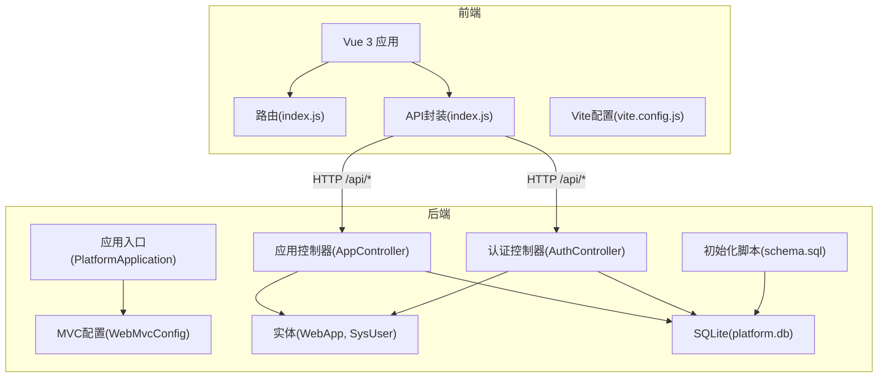
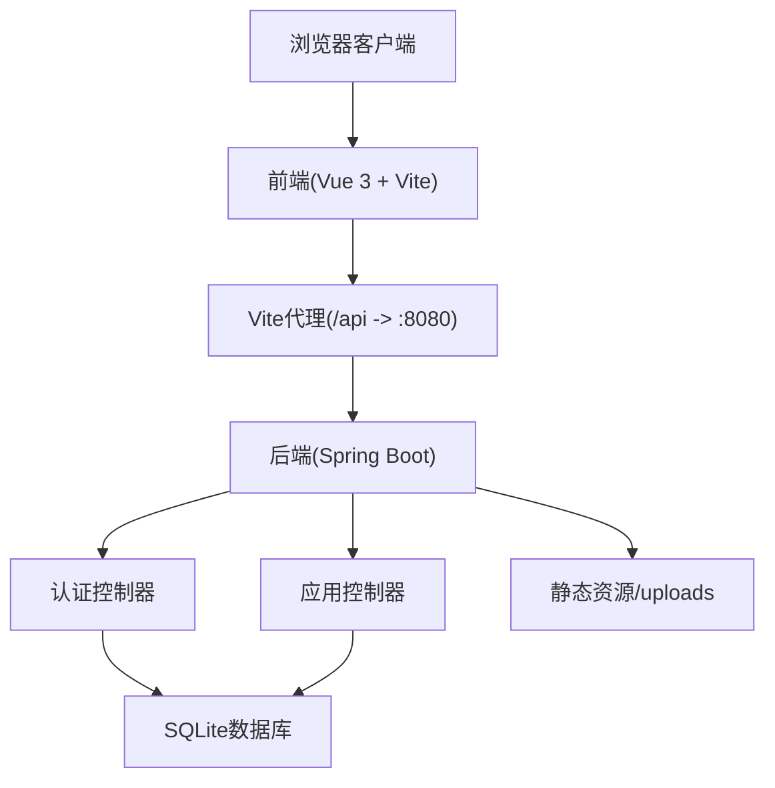
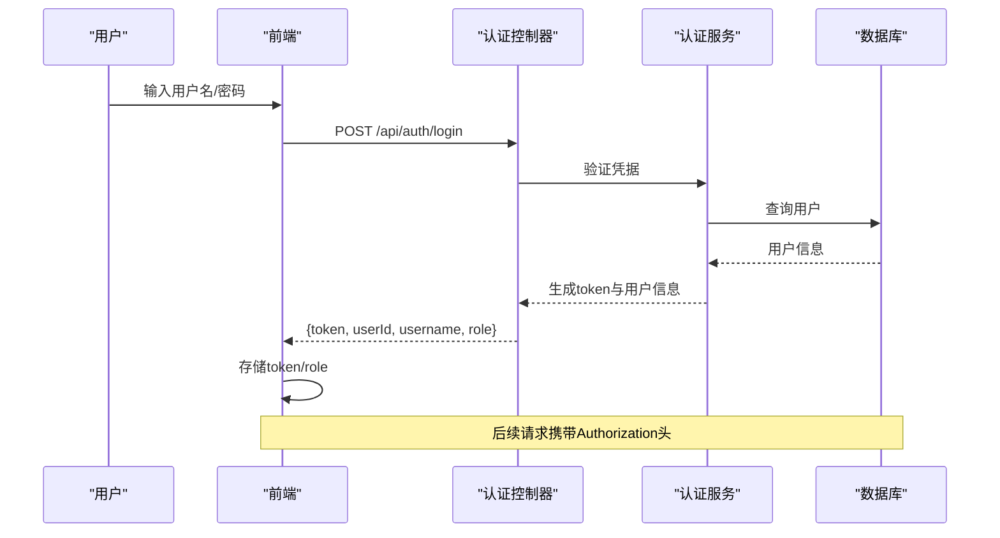
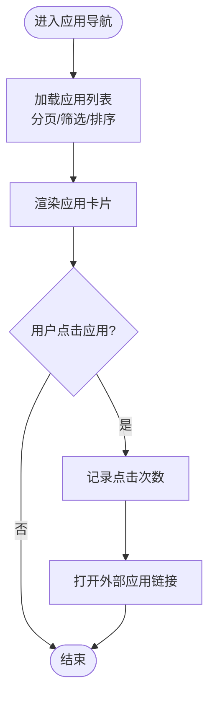
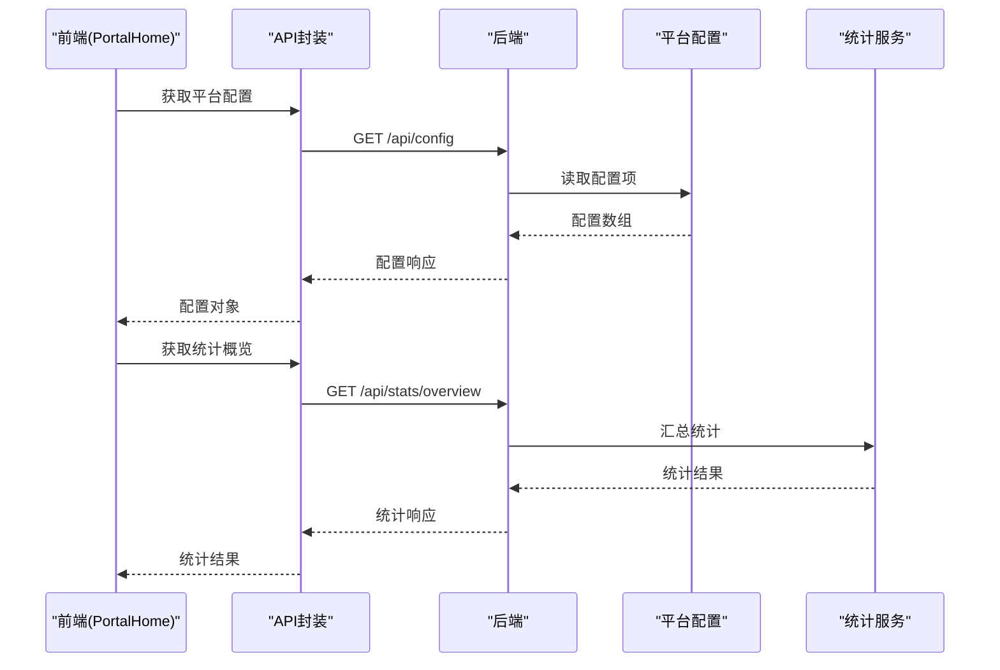
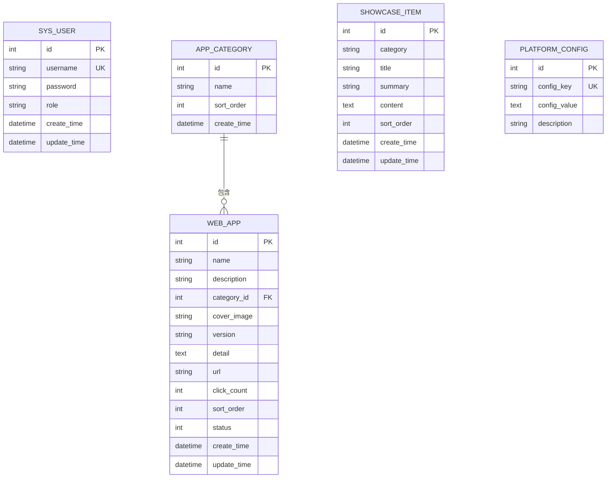
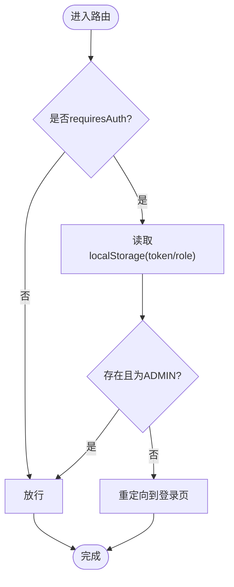
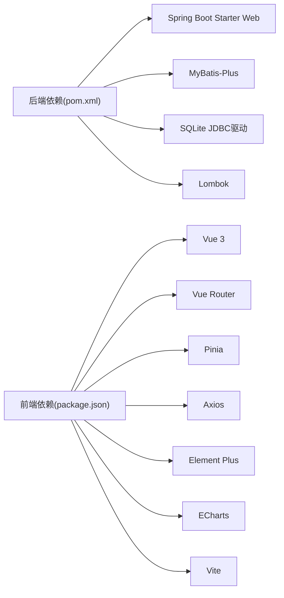

# 项目概述

<cite>
**本文引用的文件**   
- [PlatformApplication.java](file://backend/src/main/java/com/xx/platform/PlatformApplication.java)
- [WebMvcConfig.java](file://backend/src/main/java/com/xx/platform/config/WebMvcConfig.java)
- [application.yml](file://backend/src/main/resources/application.yml)
- [schema.sql](file://backend/src/main/resources/schema.sql)
- [pom.xml](file://backend/pom.xml)
- [AppController.java](file://backend/src/main/java/com/xx/platform/controller/AppController.java)
- [AuthController.java](file://backend/src/main/java/com/xx/platform/controller/AuthController.java)
- [WebApp.java](file://backend/src/main/java/com/xx/platform/entity/WebApp.java)
- [SysUser.java](file://backend/src/main/java/com/xx/platform/entity/SysUser.java)
- [API.md](file://API.md)
- [package.json](file://frontend/package.json)
- [vite.config.js](file://frontend/vite.config.js)
- [index.js（路由）](file://frontend/src/router/index.js)
- [PortalHome.vue](file://frontend/src/views/PortalHome.vue)
- [index.js（前端API封装）](file://frontend/src/api/index.js)
</cite>

## 目录
1. [简介](#简介)
2. [项目结构](#项目结构)
3. [核心组件](#核心组件)
4. [架构总览](#架构总览)
5. [详细组件分析](#详细组件分析)
6. [依赖分析](#依赖分析)
7. [性能考虑](#性能考虑)
8. [故障排查指南](#故障排查指南)
9. [结论](#结论)
10. [附录](#附录)

## 简介
JZPlatform门户系统是一个“多Web应用导航与产品宣贯门户”，旨在为公司内部各类Web应用提供统一访问入口，同时集中展示公司产品体系、技术成果与知识产权信息。系统采用前后端分离架构：后端基于Spring Boot + MyBatis-Plus + SQLite，提供REST API；前端基于Vue 3 + Vite + Element Plus，提供用户界面与管理后台。通过统一的配置管理与权限控制，实现应用的分类导航、点击统计、内容宣贯与平台设置等能力。

主要特性
- 统一入口：聚合公司内多个Web应用，按分类展示并提供一键跳转
- 产品宣贯：结构化展示产品体系、模型体系、数据体系与知识产权等信息
- 权限管理：管理员可管理应用、分类、宣贯内容与平台配置
- 统计概览：首页展示应用数量、访问量、分类数与用户数等关键指标
- 轻量部署：SQLite作为默认数据库，便于快速启动与演示

使用场景示例
- 新员工入职：通过门户快速了解公司产品与技术成果，并进入常用业务系统
- 管理层看板：在首页查看应用活跃度与访问量，辅助运营决策
- 管理员维护：在后台新增应用、调整分类、发布宣贯内容、上传Logo与背景图

## 项目结构
项目采用前后端分离的目录组织方式：
- backend：Spring Boot后端服务，包含控制器、服务层、实体、配置与资源脚本
- frontend：Vue 3前端工程，包含路由、页面、API封装与构建配置
- API.md：接口文档与使用说明

图表来源
- [PlatformApplication.java:1-16](file://backend/src/main/java/com/xx/platform/PlatformApplication.java#L1-L16)
- [WebMvcConfig.java:1-37](file://backend/src/main/java/com/xx/platform/config/WebMvcConfig.java#L1-L37)
- [AuthController.java:1-68](file://backend/src/main/java/com/xx/platform/controller/AuthController.java#L1-L68)
- [AppController.java:1-111](file://backend/src/main/java/com/xx/platform/controller/AppController.java#L1-L111)
- [WebApp.java:1-54](file://backend/src/main/java/com/xx/platform/entity/WebApp.java#L1-L54)
- [SysUser.java:1-33](file://backend/src/main/java/com/xx/platform/entity/SysUser.java#L1-L33)
- [schema.sql:1-80](file://backend/src/main/resources/schema.sql#L1-L80)
- [vite.config.js:1-20](file://frontend/vite.config.js#L1-L20)

章节来源
- [PlatformApplication.java:1-16](file://backend/src/main/java/com/xx/platform/PlatformApplication.java#L1-L16)
- [API.md:1-197](file://API.md#L1-L197)
- [package.json:1-25](file://frontend/package.json#L1-L25)

## 核心组件
- 应用入口与全局配置
  - Spring Boot应用入口负责启动容器与自动装配
  - Web MVC配置开启CORS跨域与静态资源映射（如上传文件）
  - application.yml定义端口、数据源、MyBatis-Plus与上传大小限制
- 认证模块
  - 登录/登出/获取当前用户信息，返回token用于后续鉴权
- 应用导航模块
  - 公开接口：应用列表（分页/筛选/排序）、详情、点击记录
  - 管理员接口：新增、编辑、删除应用
- 数据模型
  - 用户、应用、分类、宣贯项、平台配置等实体与表结构
- 前端工程
  - Vue 3 + Vite开发环境，Element Plus UI库，ECharts图表
  - 路由守卫实现登录态校验与标题设置
  - API封装统一调用后端接口

章节来源
- [WebMvcConfig.java:1-37](file://backend/src/main/java/com/xx/platform/config/WebMvcConfig.java#L1-L37)
- [application.yml:1-29](file://backend/src/main/resources/application.yml#L1-L29)
- [AuthController.java:1-68](file://backend/src/main/java/com/xx/platform/controller/AuthController.java#L1-L68)
- [AppController.java:1-111](file://backend/src/main/java/com/xx/platform/controller/AppController.java#L1-L111)
- [WebApp.java:1-54](file://backend/src/main/java/com/xx/platform/entity/WebApp.java#L1-L54)
- [SysUser.java:1-33](file://backend/src/main/java/com/xx/platform/entity/SysUser.java#L1-L33)
- [package.json:1-25](file://frontend/package.json#L1-L25)
- [index.js（路由）:1-99](file://frontend/src/router/index.js#L1-L99)

## 架构总览
系统采用典型的前后端分离架构：前端通过Vite代理将/api请求转发至后端，后端以RESTful风格暴露接口，数据持久化到SQLite。

图表来源
- [vite.config.js:1-20](file://frontend/vite.config.js#L1-L20)
- [AuthController.java:1-68](file://backend/src/main/java/com/xx/platform/controller/AuthController.java#L1-L68)
- [AppController.java:1-111](file://backend/src/main/java/com/xx/platform/controller/AppController.java#L1-L111)
- [application.yml:1-29](file://backend/src/main/resources/application.yml#L1-L29)
- [WebMvcConfig.java:1-37](file://backend/src/main/java/com/xx/platform/config/WebMvcConfig.java#L1-L37)

## 详细组件分析

### 认证流程（登录与鉴权）
认证流程包括用户登录、服务端返回token、前端保存并在后续请求头携带Authorization进行鉴权。

图表来源
- [AuthController.java:1-68](file://backend/src/main/java/com/xx/platform/controller/AuthController.java#L1-L68)
- [API.md:1-197](file://API.md#L1-L197)

章节来源
- [AuthController.java:1-68](file://backend/src/main/java/com/xx/platform/controller/AuthController.java#L1-L68)
- [API.md:1-197](file://API.md#L1-L197)

### 应用导航与点击统计
应用导航支持分页、筛选与排序，点击统计用于衡量应用热度。

图表来源
- [AppController.java:1-111](file://backend/src/main/java/com/xx/platform/controller/AppController.java#L1-L111)
- [index.js（前端API封装）:1-137](file://frontend/src/api/index.js#L1-L137)

章节来源
- [AppController.java:1-111](file://backend/src/main/java/com/xx/platform/controller/AppController.java#L1-L111)
- [index.js（前端API封装）:1-137](file://frontend/src/api/index.js#L1-L137)

### 首页展示与配置加载
首页动态加载平台配置与统计数据，展示平台名称、公司信息、Logo与关键指标。

图表来源
- [PortalHome.vue:1-287](file://frontend/src/views/PortalHome.vue#L1-L287)
- [index.js（前端API封装）:1-137](file://frontend/src/api/index.js#L1-L137)
- [API.md:1-197](file://API.md#L1-L197)

章节来源
- [PortalHome.vue:1-287](file://frontend/src/views/PortalHome.vue#L1-L287)
- [index.js（前端API封装）:1-137](file://frontend/src/api/index.js#L1-L137)
- [API.md:1-197](file://API.md#L1-L197)

### 数据模型与关系
核心实体包括用户、应用、分类、宣贯项与平台配置，对应数据库表由初始化脚本创建。

图表来源
- [schema.sql:1-80](file://backend/src/main/resources/schema.sql#L1-L80)
- [WebApp.java:1-54](file://backend/src/main/java/com/xx/platform/entity/WebApp.java#L1-L54)
- [SysUser.java:1-33](file://backend/src/main/java/com/xx/platform/entity/SysUser.java#L1-L33)

章节来源
- [schema.sql:1-80](file://backend/src/main/resources/schema.sql#L1-L80)
- [WebApp.java:1-54](file://backend/src/main/java/com/xx/platform/entity/WebApp.java#L1-L54)
- [SysUser.java:1-33](file://backend/src/main/java/com/xx/platform/entity/SysUser.java#L1-L33)

### 前端路由与权限控制
前端通过路由守卫检查登录态与角色，仅允许管理员访问管理后台。

图表来源
- [index.js（路由）:1-99](file://frontend/src/router/index.js#L1-L99)

章节来源
- [index.js（路由）:1-99](file://frontend/src/router/index.js#L1-L99)

## 依赖分析
后端依赖Spring Boot生态与MyBatis-Plus，使用SQLite作为嵌入式数据库；前端依赖Vue 3、Vite、Element Plus与ECharts。

图表来源
- [pom.xml:1-79](file://backend/pom.xml#L1-L79)
- [package.json:1-25](file://frontend/package.json#L1-L25)

章节来源
- [pom.xml:1-79](file://backend/pom.xml#L1-L79)
- [package.json:1-25](file://frontend/package.json#L1-L25)

## 性能考虑
- 数据库选择：SQLite适合单机与演示场景，具备零配置与低开销优势；若需高并发或分布式部署，建议迁移至MySQL/PostgreSQL并引入连接池与索引优化
- 静态资源：上传文件通过静态资源映射直接访问，减少后端处理压力；建议在生产环境结合CDN或对象存储
- 前端构建：Vite提供快速开发与热更新，生产构建产物可通过反向代理或静态服务器部署
- 缓存策略：对热点配置与统计数据进行本地缓存可减少数据库压力（例如Redis），但当前版本未实现

[本节为通用指导，不直接分析具体文件]

## 故障排查指南
- 跨域问题：确认后端已启用CORS，允许/api/**路径与必要方法；开发阶段确保Vite代理正确转发/api与/uploads
- 登录失败：检查用户名与密码是否正确，确认数据库初始化脚本已执行并插入默认管理员账户
- 文件上传失败：检查application.yml中multipart大小限制与uploads目录写入权限；确认静态资源映射路径有效
- 路由无法访问：检查路由守卫逻辑与localStorage中的token/role是否正确设置

章节来源
- [WebMvcConfig.java:1-37](file://backend/src/main/java/com/xx/platform/config/WebMvcConfig.java#L1-L37)
- [application.yml:1-29](file://backend/src/main/resources/application.yml#L1-L29)
- [schema.sql:1-80](file://backend/src/main/resources/schema.sql#L1-L80)
- [index.js（路由）:1-99](file://frontend/src/router/index.js#L1-L99)

## 结论
JZPlatform门户系统以简洁的技术栈实现了企业级应用导航与产品宣贯的核心需求，具备良好的可扩展性与易用性。对于初学者，可从前后端分离的基本概念入手，逐步理解路由、API、实体与配置的关系；对于有经验的开发者，可在现有基础上扩展更多功能，如引入更完善的鉴权机制、缓存与监控、以及面向生产的部署方案。

[本节为总结性内容，不直接分析具体文件]

## 附录
- 启动说明与默认账户请参考接口文档
- 如需了解更多接口细节，请查阅API文档

章节来源
- [API.md:1-197](file://API.md#L1-L197)